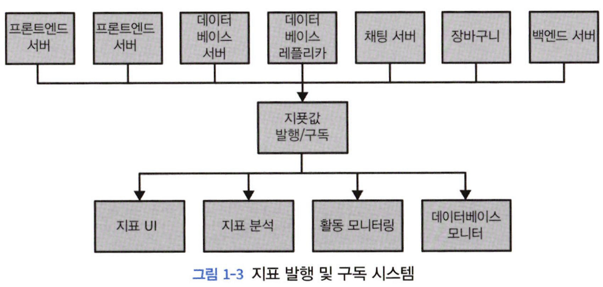
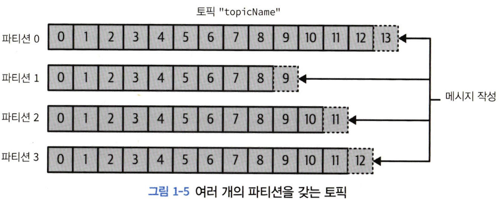
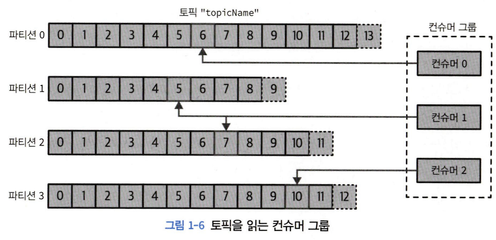
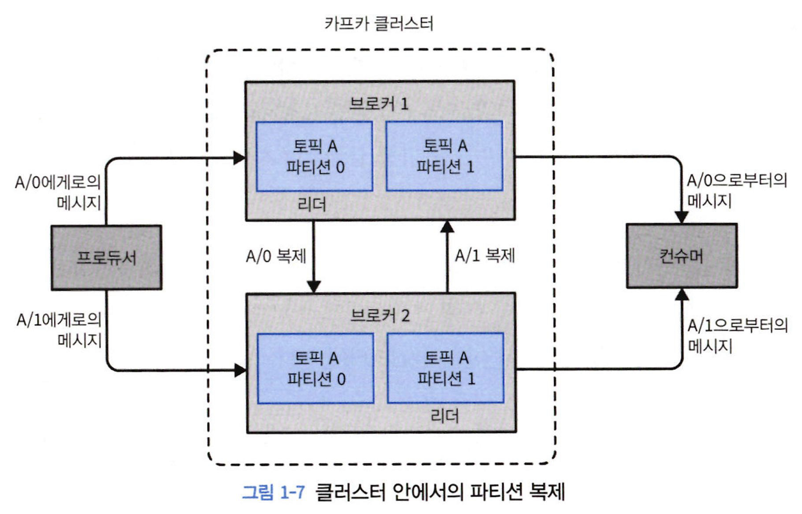
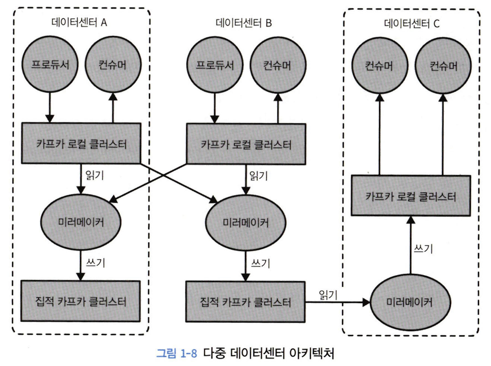

# 1. 카프카 시작하기

# 1.1 발행/구독 메시지 전달

비즈니스가 확장됨에 따라 함께 확장되는, 일반화된 유형의 데이터를 발행하고 구독할 수 있는 중앙 집중화된 시스템이 필요하다.

---

# 1.2 카프카 입문

## 1.2.1 메시지와 배치

- 메시지(message) : 카프카에서 데이터의 기본 단위
    - 카프카 입장에서 메시지는 단순한 바이트의 배열로 간주된다.
    - 메시지는 키(key)라 불리는 메타데이터를 포함할 수 있다.
    - 키(key) : 메시지를 저장할 파티션을 결정하기 위해 사용
- 배치(batch) : 메시지 저장 단위
    - 메시지를 쓸 때마다 발생하는 네트워크상의 오버헤드를 줄일 수 있다.
    - 지연(latency)와 처리량(throughput)사이에 트레이드오프를 발생시킨다.

## 1.2.2 스키마

카프카 입장에서 메시지는 단순한 바이트 배열일 뿐이지만, 내용을 이해하기 쉽도록 일정한 구조(혹은 스키마)를 부여하는 것이 권장된다.

- Apache Avro
    - 조밀한 직렬화 형식 제공
    - 메시지 본체와 스키마를 분리
        - 스키마 변경시 코드를 생성할 필요없음.
    - 강력한 데이터 타이핑
    - 스키마 변경에 따른 상위 호환성, 하위 호환성 지원

## 1.2.3 토픽과 파티션

- 토픽(topic) : 메시지 분류 단위
    - 데이터베이스 테이블이나 파일시스템의 폴더와 유사한 개념
    - 토픽은 여러 개의 파티션(partition)으로 나뉘어진다.
- 파티션(partition) 특징
    - 파티션에 메시지가 쓰여질 때는 추가만 가능(append-only)형태로 쓰여진다.
    - 읽을 때는 맨 앞부터 제일 끝까지의 순서로 읽한다.
    - 복수 개의 파티션이 있는 경우 토픽 안의 메시지 전체에 대해 순서가 보장되지 않는다.
    - 데이터 중복성과 확장성을 제공한다.
        - 확장성
            - 각 파티션이 서로 다른 서버에 저장 → 하나의 토픽이 여러 개의 서버로 수평적 확장 → 하나의 서버의 용량을 넘어가는 성능을 보여줌.
        - 데이터 중복성
            - 서로 다른 서버들이 동일한 파티션의 복제본을 저장 → 장애 발생 시 대처 가능

- 스트림(stream) : 하나의 토픽에 저장된 데이터
    - 프로듀서(producer) → 컨슈머(consumer)로의 하나의 데이터 흐름

## 1.2.4 프로듀서와 컨슈머

- 프로듀서 : 새로운 메시지를 생성
    - 메시지를 쓸 때 토픽에 속한 파티션에 고르게 나눠서 쓴다.
    - 특정한 파티션을 지정해서 메시지를 쓰기도 한다.
        - 파티셔너(partitioner) : 메시지 키와 키 값의 해시를 특정 파티션으로 대응시킴.
        - 동일한 키 값을 가진 모든 메시지는 같은 파티션에 저장된다.
- 컨슈머 : 메시지를 읽음.
    - 1개 이상의 토픽을 구독해서 메시지를 파티션에 쓰여진 순서대로 읽는다.
    - 메시지의 오프셋을 기록해 어느 메시지까지 읽었는지 유지한다.
        - 오프셋(offset) : 메시지에 부여하는 메타데이터
- 컨슈머 그룹
    - 토픽에 저장된 데이터를 읽어오기 위해 협업하는 하나 이상의 컨슈머로 이루어진다.
    - 각 파티션이 하나의 컨슈머에 의해서만 읽히도록 한다.
    - 컨슈머 중 하나에 장애 발생 시, 그룹 안의 다른 컨슈머들이 장애 발생한 컨슈머가 읽고 있던 파티션을 재할당 받는다.
    
    
    

## 1.2.5 브로커와 클러스터

- 브로커(broker) : 하나의 카프카 서버
    - 프로듀서로 부터 메시지를 전달받아 오프셋 할당 후 디스크 저장소 쓴다.
- 클러스터 : 복수 개의 브로커의 그룹
    - 컨트롤러 : 관리 기능을 담당하는 브로커
        - 브로커에 파티션 할당
        - 장애 발생한 브로커 모니터링
- 파티션 리더 - 브로커 1개 자동 선정
    - 파티션은 클러스터 안의 브로커 중 하나가 담당한다.
- 파티션 팔로워
    - 복제된 파티션을 여러 브로커에 할당한다.
    - 리더 브로커에 장애 발생 시 팔로워 중 하나가 리더 역할을 이어 받는다.
    
    
    
    ### 브로커의 보존 설정
    
    - 카프카에는 메시지를 지속성있게 보관하는 보존 기능이 있다.
    - 특정 기간동안 메시지 보존하거나 파티션의 크기가 특정 사이즈에 도달할 때까지 데이터를 보존한다.
    - 각각 토픽에서 메시지가 필요한 정도까지만 저장되도록 보존 설정을 잡을 수 있다.
    - 로그 압착(log compaction)
        - 같은 키를 갖는 메시지 중 가장 최신의 것만 보존된다.
        - 마지막 변경값만이 중요한 체인지로그 형태의 데이터에 적용하면 좋다.
        

## 1.2.6 다중 클러스터

다중 클러스터의 장점

- 데이터 유형별 분리
- 보안 요구사항을 충족시키기 위한 격리
- 재해 복구를 대비한 다중 데이터 센터

미러메이커 : 데이터를 다른 클러스터로 복제하는 툴

---

# 1.3 왜 카프카인가?

- 다중 프로듀서
- 다중 컨슈머
- 디스크 기반 보존 - 메시지를 지속성 있게 저장할 수 있다.
- 확장성
- 고성능
- 플랫폼 기능 - 카프카 커넥트, 스트림즈
- 데이터 생태계 - 모든 클라이언트에 대해 일관된 인터페이스 제공