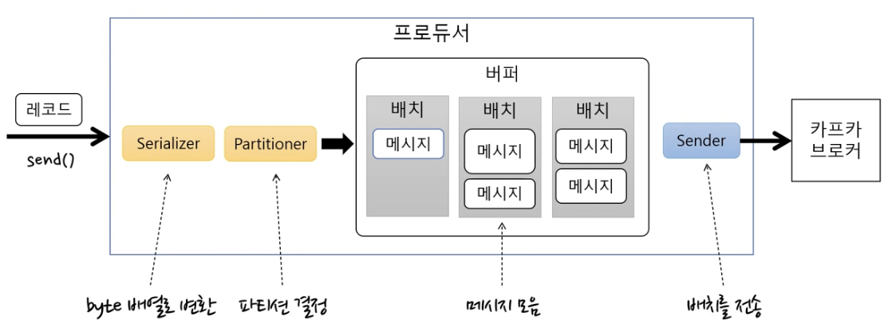
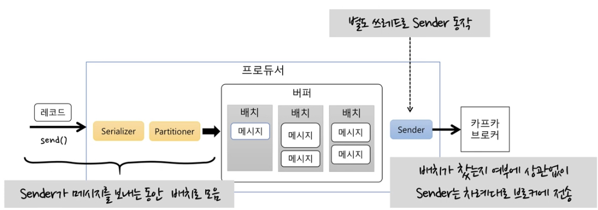
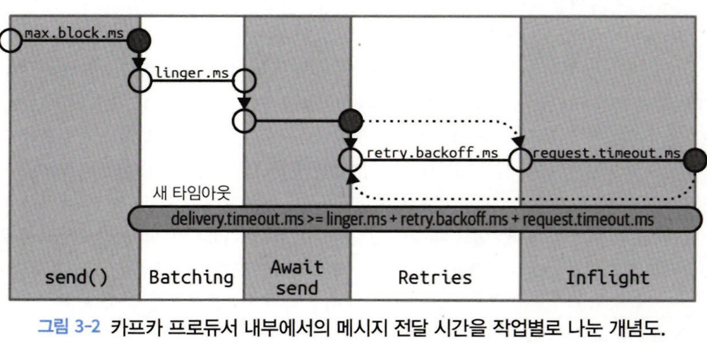
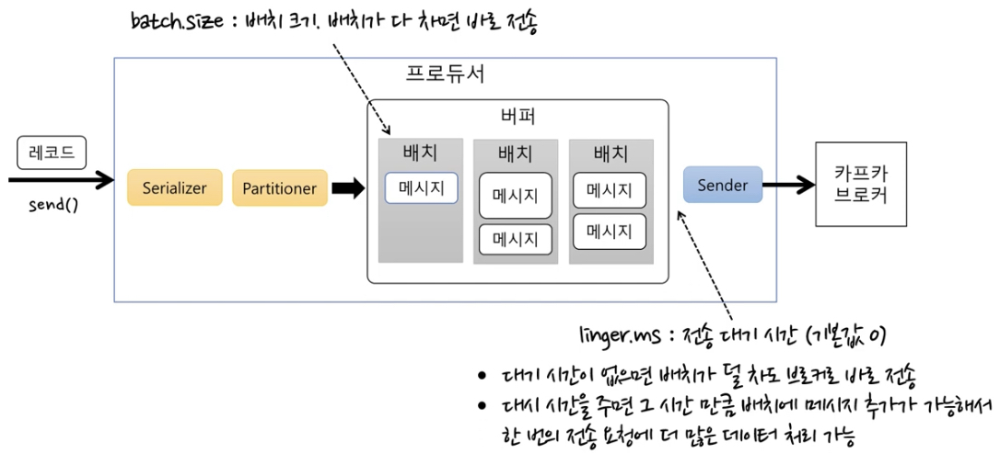
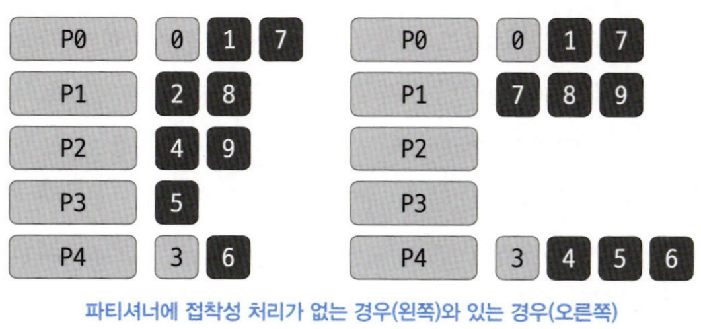

# 3. 카프카 프로듀서

# 3.1 프로듀서 개요

서로 다른 요구 조건은 카프카에 메시지를 쓰기 위해 프로듀서 API를 사용하는 방식과 설정에 영향을 미친다.

### 데이터 전송 시 수행되는 주요 단계

1. **ProducerRecord 생성**:
    - 필수: 토픽 및 값 지정
    - 선택: 키 및 파티션 지정
2. **직렬화**: 데이터를 카프카 전송 형식에 맞게 변환
3. **파티션 결정**: ProducerRecord의 키를 기반으로 목적지 파티션 결정
4. **배치 추가**: 전송할 레코드를 배치에 추가
5. **배치 전송**: 별도 스레드가 레코드 배치를 해당 카프카 브로커로 전송



---

# 3.2 카프카 프로듀서 생성하기

### 프로듀서 필수 속성 값

bootstrap.servers : 카프카 클러스터에 초기 연결을 위한 브로커의 목록

- 모든 브로커를 포함할 필요는 없다.
- 브로커 중 하나에 장애가 발생할 경우를 대비해 최소 2개 이상을 지정하는 것을 권장한다.

key.serializer : 프로듀서가 메시지의 키를 바이트 배열로 직렬화하는 데 사용하는 클래스 이름

value.serializer : 프로듀서가 메시지의 값을 바이트 배열로 직렬화하는 데 사용하는 클래스 이름

```java
Properties kafkaProps = new Properties();
kafkaProps.put("bootstrap.servers", "localhost:9092,localhost:9093,localhost:9094");

kafkaProps.put("key.serializer",
        "org.apache.kafka.common.serialization.StringSerializer");
kafkaProps.put("value.serializer",
        "org.apache.kafka.common.serialization.StringSerializer");

KafkaProducer<String, String> producer = new KafkaProducer<String,String>(kafkaProps);
```

### 메시지 전송 방법

1. **파이어 인 포겟(Fire-and-Forget)**:
    - 메시지를 서버에 전송하고, 그 성공 또는 실패 여부에 신경쓰지 않습니다.
    - 전송 속도가 빠르지만, 메시지 손실 위험이 있습니다.
2. **동기적 전송(Synchronous Send)**:
    - **`get()`** 메서드를 사용하여 메시지 전송 후 카프카 브로커로부터 응답을 대기합니다.
    - 전송 성공 여부를 확인할 수 있으나, 대기 시간으로 인해 전송 속도가 느려질 수 있습니다.
3. **비동기적 전송(Asynchronous Send)**:
    - **`send()`** 메서드와 함께 콜백 함수를 전달하여 메시지를 전송합니다.
    - 카프카 브로커로부터 응답을 받을 때 해당 콜백 함수가 호출됩니다.
    - 빠른 전송 속도를 유지하면서도 전송 결과에 따른 작업을 수행할 수 있습니다.
    

---

# 3.3 카프카로 메시지 전달하기

```java
KafkaProducer<String, String> producer = new KafkaProducer<String,String>(kafkaProps);

ProducerRecord<String, String> record =
        new ProducerRecord<>("CustomerCountry", "Precision Products", "France");
try {
    producer.send(record);
} catch (Exception e) {
    e.printStackTrace();
}
```

- send() 메서드는 RecordMetadata를 포함한 자바 Future 객체를 리턴하지만, 현재 코드에서는 리턴값을 무시한다.



### 동기적으로 메시지 전송하기

동기적으로 메세지를 전송할 경우 전송을 요청하는 쓰레드는 이 시간 동안 아무것도 안 하면서 기다려야 한다.

결과적으로 성능이 크게 낮아지기 때문에 동기적 전송은 실제로 사용되는 애플리케이션에서는 잘 사용되지 않는다.

```java
ProducerRecord<String, String> record =
        new ProducerRecord<>("CustomerCountry", "Precision Products", "France");
try {
    RecordMetadata metadata = producer.send(record).get();
    System.out.println(metadata.toString());
} catch (Exception e) {
    e.printStackTrace();
}
```

- 재시도 가능한 에러 : 연결 에러 - 새 리더 선출 후 재시도 가능
- 재시도 불가능한 에러 : 메시지 크기 에러

### 비동기적으로 메시지 전송하기

다음 예제는 콜백을 사용하는 방법을 보여준다.

```java
private class DemoProducerCallback implements Callback {
    @Override
    public void onCompletion(RecordMetadata recordMetadata, Exception e) {
        if ( e != null ){
            e.printStackTrace();
        }
    }
}

ProducerRecord<String, String> record =
        new ProducerRecord<>(topic, key, value);
producer.send(record, new DemoProducerCallback());
```

<aside>
💡 콜백은 프로듀서의 메인 스레드에서 실행되기 때문에 콜백 안에서 블로킹 작업을 수행하는 것은 권장되지 않는다.
블로킹 작업을 동시에 수행하는 다른 스레드를 사용해야 한다.

</aside>

---

# 3.4 프로듀서 설정하기

### client.id

- 프로듀서와 그것을 사용하는 애플리케이션을 구분하기 위한 논리적 식별자
- 브로커는 프로듀서가 보내온 메시지를 서로 구분하기 위해 이 값을 사용한다.

```java
client.id = producer-1
```

## acks

- ack = 0
    - 서버 응답을 기다리지 않음
    - 전송 보장도 zero
- ack = 1
    - 파티션의 리더에 저장되면 응답 받음
    - 리더 장애 시 메시지 유실 가능
- ack = all (또는 -1)
    - 모든 리플리카에 저장되면 응답을 받음
        - 브로커 min.insync.replicas 설정에 따라 달라짐

## 메세지 전달 시간



1. **max.block.ms**:
    - 이 설정은 **`send()`** 메서드나 **`partitionsFor()`** 메서드가 호출될 때 최대 얼마나 블로킹되도록 허용할지를 정의한다.
    - 메타데이터 가져오기, 버퍼 공간 확보 등 필요한 조건이 충족되지 않을 때 이 시간 동안 대기하도록 설정된다.
    - 지정된 시간이 초과되면 **`TimeoutException`**이 발생합니다.
2. **delivery.timeout.ms**:
    - 메시지의 전달을 완료하기 위한 최대 시간을 정의한다.
    - 이 시간 동안 메시지가 성공적으로 전송되지 않으면 프로듀서는 메시지 전송에 실패했다고 판단한다.
    - 이 값은 **`request.timeout.ms`**와 **`retry.backoff.ms`**를 포함하는 여러 재시도 시간에 영향을 받는다.
3. **request.timeout.ms**:
    - 브로커에게 메시지를 전송한 후 응답을 기다리는 최대 시간이다.
    - 이 시간 동안 브로커로부터 응답이 없으면, 프로듀서는 해당 요청을 실패한 것으로 간주하고 재시도를 수행할 수 있다.
4. **retries**:
    - 프로듀서가 메시지 전송 실패 시 재시도하는 횟수이다.
    - 이 값이 0이면 재시도하지 않고, 그보다 큰 값이면 지정된 횟수만큼 재시도를 한다.
5. **retry.backoff.ms**:
    - 프로듀서가 메시지 전송에 실패했을 때 다음 재시도 사이의 대기 시간이다.
    - 이 값에 따라 프로듀서는 재시도 전에 일정 시간 대기하게 된다.

## 처리량 관련 주요 속성

배치와 Sender에 대한 설정이 처리량에 영향을 준다.

- batchSize : 배치 크기
- [linger.ms](http://linger.ms) : 전송 대기 시간



## 재시도 순서

max.in.flight.requests.per.connection

- 블록킹 없이 한 커넥션에서 전송할 수 있는 최대 전송중인 요청 개수
1. **순서 보장**: **`max.in.flight.requests.per.connection`** 값을 1로 설정하면 한 번에 하나의 요청만 전송되므로 메시지의 순서가 보장된다.
2. **재시도와의 관계**: Kafka 0.11.0.0 이후의 버전에서는 **`enable.idempotence`** 설정을 사용하여 프로듀서의 재시도 동작을 개선하였다. 이 경우 **`max.in.flight.requests.per.connection`** 값을 5로 설정해도 메시지 순서가 보장된다.

<aside>
💡 멱등적 프로듀서 기능을 활성화하기

1. max.in.flight.requests.per.connection 매개변수 : 5이하
2. retries : 1이상
3. acks=all

</aside>

---

# 3.5 시리얼라이저

## 아파치 에이브로를 사용해서 직렬화하기

### 에이브로 특징

1. **언어-독립적인 스키마**: Avro는 다양한 프로그래밍 언어에서 사용될 수 있는 독립적인 스키마를 제공한다.
2. **스키마 기반 직렬화**: 주어진 스키마에 따라 데이터는 직렬화되며, 이렇게 직렬화된 데이터는 스키마에 정의된 형식을 정확히 따른다.
3. **스키마 내장**: Avro 파일 형식은 스키마 정보를 직접 포함하므로 별도의 스키마 저장소가 필요하지 않다.
4. **스키마의 호환성**: Avro는 스키마의 변화를 관리하며, 적절한 호환성 규칙을 유지하면서 스키마를 진화시킬 수 있다. 이로 인해 기존 데이터와 새로운 데이터 모두를 처리할 수 있다.

---

# 3.6 파티션

## 키의 역할

1. 메시지에 함께 저장되는 추가적인 정보
2. 메시지가 저장될 파티션을 결정짓는 기준점
    
    ⇒ 같은 키 값을 가진 모든 메시지는 같은 파티션에 저장된다.
    

## 키값이 null인 레코드

- 레코드는 현재 사용 가능환 토픽의 파티션 중 하나에 랜덤하게 저장
- 각 파티션별로 저장되는 메시지 개수의 균형을 맞추기 위해 라운드 로빈 알고리즘 사용 ( + 접착성 처리 )

### 📌 접착성 처리

접착성 처리가 없을 경우

- 키값이 null인 메시지들은 5개의 파티션에 라운드 로빈 방식으로 배치되게 된다.

접착성 처리가 있을 경우

- 프로듀서가 메시지 배치를 채울 때 다음 배치로 넘어가기 전 이전 배치를 먼저 채운다.
- 키값이 null인 메시지들은 일단 키값이 있는 메시지 뒤에 따라붙은 다음에야 라운드 로빈 방식으로 배치된다.

⇒ 보내야 하는 요청의 수가 5개에서 3개로 줄어든다.

⇒ 힌 반에 브로커로 보낼 수 있는 메시지 한도를 최대한 활용해서 보내게 된다.



## 키값이 지정된 경우

카프카는 키값을 해시한 결과를 기준으로 메시지를 저장할 파티션을 특정한다.

⇒ 동일한 키값은 항상 동일한 파티션에 저장된다.


---

# 3.7 헤더

레코드 헤더는 카프카 레코드의 키/밸류값을 건드리지 않고 추가 메타데이터를 심을 때 사용한다.

- 헤더 데이터를 이용해 메시지를 라우팅하거나 출처를 추적할 수 있다.

```java
ProducerRecord<String, String> record =
        new ProducerRecord<>("CustomerCountry", "Precision Products", "France");
record.headers().add("privacy-level", "YOLO".getBytes(StandardCharsets.UTF_8));
```

---

# 3.8 인터셉터

카프카 클라이언트의 코드를 고치지 않으면서 그 작동을 변경해야하는 경우에 카프카 ProducerInterceptor 인터셉터를 사용한다.

```java
ProducerRecord<K, V> onSend(ProducerRecord<K, V> record)
```

- 프로듀서가 레코드를 브로커로 보내기 전, 직렬화되기 직전에 호출된다.
- 보내질 레코드에 담긴 정보를 확인 및 수정할 수 있다.
- 이 메서드가 리턴한 레코드가 직렬화되어 카프카로 보내진다.

```java
void onAcknowledgement(RecordMetadata metadata, Exception exception)
```

- 카프카 브로커가 보낸 응답을 클라이언트가 받았을 때 호출된다.
- 브로커가 보낸 응답을 변경할 수는 없지만, 담긴 정보를 읽을 수 있다.

---

# 3.9 쿼터, 스로틀링

## 쿼터(quota)

카프카 브로커에는 쓰기, 읽기 속도를 제한할 수 있는 기능이 있다.

### 쿼터 타입

1. 쓰기 쿼터
2. 읽기 쿼터
3. 요청 쿼터

모든 클라이언트에 적용되는 쓰기/읽기 쿼터의 기본 값은 카프카 브로커를 설정할 때 함께 설정해줄 수 있다.

- quota.producer.default=2M

### 동적으로 쿼터 값 지정하는 방법

- clientC(client-id 값)의 쓰기 속도를 초당 1024 바이트로 제한한다.

```java
/bin/kafka-configs --bootstrap-server localhost:9092 --alter \
	--add-config 'producer_byte_rate=1024' --entity-name clientC \
  --entity-type clients
```

- user1(인증 주체로 지정)의 쓰기 속도를 초당 1024바이트로 읽기 속도는 초당 2048바이트로 제한한다.

```java
/bin/kafka-configs --bootstrap-server localhost:9092 --alter \
	--add-config 'producer_byte_rate=1024,consumer_byte_rate=2048' \
  --entity-name user1 \
  --entity-type users
```

- 모든 사용자의 읽기 속도를 초당 2048 바이트로 제한하되, 기본 설정값을 덮어쓰고 있는 사용자에 대해서는 에외로 한다.

```java
/bin/kafka-configs --bootstrap-server localhost:9092 --alter \
	--add-config 'consumer_byte_rate=2048' \
  --entity-type users
```

## 스로틀링(throttling)

클라이언트가 할당량을 다 채웠을 경우, 브로커는 클라이언트의 요청에 대한 스로틀링을 시작하여 할당량을 초과하지 않도록한다.

클라이언트 입장에서는 다음의 JMX 메트릭을 통해 스로틀링의 작동 여부를 확인할 수 있다.

- -produce-throttle-time-avg
- -produce-throttle-time-max
- -fetch-throttle-time-avg
- -fetch-throttle-time-max