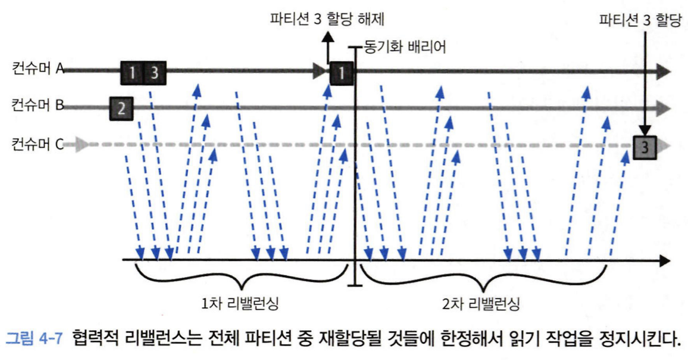

# 4. 카프카 컨슈머

# 4.1 카프카 컨슈머: 개념

## 컨슈머와 컨슈머 그룹

토픽으로 부터 데이터를 읽어오는 작업을 확장할 수 있어야 한다.

여러 개의 컨슈머가 같은 토픽으로 부터 데이터를 분할해서 읽어올 수 있어야 한다.

### 파티션과 컨슈머

- 컨슈머 그룹 단위로 파티션 할당
    - 파티션 개수보다 컨슈머 개수가 많아지게 되면 컨슈머는 논다.


<aside>
💡 토픽 생성 시 파티션 수를 크게 잡는 것이 좋은 이유
⇒ 부하가 증가함에 따라서 더 많은 컨슈머를 추가할 수 있기 때문이다.

</aside>

### 컨슈머 그룹 추가

여러 애플리케이션이 동일한 토픽에서 데이터를 읽어와야 하는 경우 컨슈머 그룹을 추가한다.


## 컨슈머 그룹과 파티션 리밸런스

리밸런스 : 컨슈머에 할당된 파티션을 다른 컨슈머에게 할당해주는 작업

### 조급한 리밸런스


### 협력적 리밸런스



컨슈머는 해당 컨슈머 그룹의 그룹 코디네이터 역할을 지정받은 카프카 브로커에 하트비트를 전송함으로써 멤버십과 할당된 파티션에 대한 소유권을 유지한다.

- 하트비트는 컨슈머의 백그라운드 스레드에 의해 전송되는데 일정한 간격을 두고 전송되는 한 연결이 유지되고 있는 것으로 간주된다.
- 만약 컨슈머가 일정 시간 이상 하트비트를 전송하지 않는다면, 세션 타임아웃이 발생하면서 그룹 코디네이터는 해당 컨슈머가 죽었다고 간주하고 리밸런스를 실행한다.
- 컨슈머를 깔끔하게 닫아줄 경우 컨슈머는 그룹 코디네이터에게 그룹을 나간다고 통지하는데, 그러면 그룹 코디네이터는 즉시 리밸런스를 실행함으로써 처리가 정지되는 시간을 줄인다.

## 정적 그룹 멤버십

- 컨슈머가 정적 멤버로서 컨슈머 그룹에 처음 참여할 경우
    - 평소와 같이 해당 그룹이 사용하고 있는 파티션 할당 전략에 따라 파티션이 할당된다.
- 컨슈머가 꺼질 경우
    - 세션 타임아웃(session.timeout.ms)이 경과될 때까지 그룹 멤버로 남아있게 된다.
- 컨슈머가 다시 그룹에 조인할 경우
    - 멤버십이 그대로 유지되기 때문에 리벨런스가 발생할 필요 없이 예전에 할당받았던 파티션들을 그대로 재할당받는다.
    - 그룹 코디네이터는 그룹 내 각 멤버에 대한 파티션 할당을 캐시해 두고 있다.
    - 컨슈머가 다시 돌아오면 이 파티션에 저장된 최신 메시지에서 한참 뒤에 있는 밀린 메시지부터 처리하게 된다.
- 정적 멤버인 컨슈머는 group.instance.id를 할당받는다.

---

# 4.2 카프카 컨슈머 생성하기

KafkaConsumer 인스턴스 생성

- 컨슈머 필수 지정 속성
    - bootstrap.servers
    - key.deserializer
    - value.deserializer
    - group.id

```java
Properties props = new Properties();
props.put("bootstrap.servers", "broker1:9092,broker2:9092");
props.put("group.id", "CountryCounter");
props.put("key.deserializer", "org.apache.kafka.common.serialization.StringDeserializer");
props.put("value.deserializer", "org.apache.kafka.common.serialization.StringDeserializer");
KafkaConsumer<String, String> consumer =
	new KafkaConsumer<String, String>(props);
```

---

# 4.3 토픽 구독하기

하나의 토픽 구독하기

```java
comsumer.subscribe(Collections.singletonList("customerCountries");
```

정규식으로 다수의 토픽 구독하기

- 정규식과 매치되는 이름을 가진 새로운 토픽 생성 시 리밸런스 발생하며 새로운 토픽으로 부터 읽기 작업 시작

```java
consumer.subscribe(Pattern.compile("test.*"));
```

- 컨슈머는 전체 토픽과 파티션에 대한 정보를 브로커에 일정한 간격으로 요청한다.
    - 토픽과 파티션 목록 크기가 상당할 경우, 정규식을 사용한 구독은 브로커, 클라이언트, 네트워크 전체에 걸쳐 상당한 오버헤드를 발생시킨다.
    - 클라이언트가 클러스터 안에 있는 토픽의 상세 정보를 조회해야 하기 떄문에 전체 클러스터에 대한 완전한 Describe 작업 권한이 부여되야 한다.

---

# 4.4 폴링 루프

컨슈머 API의 핵심은 서버에 추가 데이터가 들어왔는지 폴링하는 단순한 루프다.

```java
Duration timeout = Duration.ofMillis(100);

while(true) {
	ConsumerRecords<String, String> records = consumer.poll(timeout); // 1
	
	for (ConsumerRecord<String, String> record : records) { // 2
		System.out.printf("topic = %s, partition = %d, offset = %d, " + "customer = %s, country = %s \n",
		record.topic(), record.partition(), record.offset(), record.key(), record.value());
	
		int updatedCount = 1;
		if (custCountryMap.containskey(record.value())) {
			updatedCount = custCountryMap.get(record.value()) + 1;
		}
		custCountryMap.put(record.value(), updatedCount);

		JSONObject json = new JSONObject(custCountryMap);
		System.out.println(json.toString());
	}
}
```

1. 컨슈머는 카프카를 계속해서 폴링하지 않으면 죽은 것으로 간주되어 이 컨슈머가 읽어오고 있던 파티션들은 그룹 내의 다른 컨슈머에게 넘겨진다.
    - timeout은 컨슈머 버퍼에 데이터가 없을 경우 poll()이 블록될 수 있는 최대 시간을 결정한다. (기다리는 시간)
2. poll()은 레코드들이 저장된 List 객체를 리턴한다.

### poll()

- 컨슈머 혹은 콜백에서 뭔가 잘못될 수 있는 모든 것들은 poll()에서 예외의 형태로 발생된다.
- max.poll.interval.ms에 지정된 시간 이상으로 호출되지 않는 경우, 컨슈머는 죽은 것으로 판정되어 컨슈머 그룹에서 퇴출된다.
    
    ⇒ 🚨폴링 루프 안에서 예측 불가능한 시간 동안 블록되는 작업을 수행하는 것은 피해야 한다.
    

## 스레드 안정성

하나의 스레드당 하나의 컨슈머를 할당해야 한다.

- 하나의 애플리케이션에서 동일한 그룹에 속하는 여러 개의 컨슈머를 운용하고 싶다면 스레드를 여러 개 띄워 각각에 컨슈머를 하나씩 돌려야 한다.
- 컨슈머 로직을 자체적은 객체로 감싼 다음 자바의 ExecutorService를 사용해서 각자의 컨슈머를 가지는 다수의 스레드를 시작시키면 좋다.

---

# 4.5 컨슈머 설정하기

### 조회에 영향을 주는 주요 설정

- fetch.min.bytes : 컨슈머가 브로커로부터 레코드를 얻어올 때 받는 데이터의 최소량
    - 기본값 : 1
    - 이 값이 크면 대기 시간은 늘지만 처리량이 증가
- [fetch.max.wait.ms](http://fetch.max.wait.ms) : 데이터가 최소 크기가 될 때까지 기다릴 시간
    - 기본값 : 500
    - 브로커가 리턴할 때까지 대기하는 시간으로 poll() 메서드의 대기 시간과 다름
- fetch.max.bytes : 컨슈머가 브로커를 폴링할 때 카프카가 리턴하는 최대 바이트 수
    - 컨슈머가 데이터를 저장하기 위해 사용하는 메모리의 양을 제한
- max.partition.fetch.bytes : 파티션 당 서버가 리턴할 수 있는 최대 크기
    - 기본값 : 1048576 (1MB)
    
    ⇒ fetch.max.bytes 설정을 대신 사용할 것을 권장
    

### 타임 아웃 설정

- [session.timeout.ms](http://session.timeout.ms) : Consumer와 Kafka broker 사이의 세션 타임아웃을 설정
- [max.poll.interval.ms](http://max.poll.interval.ms) : Consumer가 **`poll()`** 호출 사이에 허용되는 최대 시간을 정의

### 그 외

- enable.auto.commit : 컨슈머가 자동으로 오프셋을 커밋할지의 여부
- partition.assignment.strategy : 파티션 할당 전략
    - Range
    - RoundRobin
    - Sticky
    - Cooperative Sticky
- client.rack : 클라이언트가 위치한 영역 식별 값
- receive.buffer.bytes : 데이터를 읽거나 쓸 때 소켓이 사용하는 TCP 수신 및 수신 버퍼의 크기
- offsets.retention.minutes : offset 데이터가 Broker에 보관되는 기간을 분 단위로 설정
    - 이 기간이 지나면, Broker는 해당 Consumer Group의 offset 데이터를 삭제
    - Consumer Group이 일정 기간 동안 inactive 상태가 된 경우, 해당 Consumer Group의 offset 정보가 삭제될 수 있다.

# 4.6 오프셋과 커밋

오프셋 커밋 : 파티션에서의 현재 위치를 업데이트하는 작업

- 전통적인 메시지 큐와는 다르게, 카프카는 레코드를 개별적으로 커밋하지 않는다.
- 컨슈머는 파티션에서 성공적으로 처리해 낸 마지막 메시지를 커밋한다.

### 컨슈머가 오프셋을 커밋하는 방법

카프카에 특수 토픽인 __consumer_offsets 토픽에 각 파티션별로 커밋된 오프셋을 업데이트하도록 하는 메시지를 보냄으로써 이루어진다.

- 컨슈머가 크래시되거나 새로운 컨슈머가 그룹에 추가될 경우 리밸런스 발생한다.
- 리밸런스 이후 각각의 컨슈머는 리밸런스 이전에 처리하고 있던 것과는 다른 파티션들을 할당받을 수 있다.
- 어디서부터 작업을 재개해야 하는지를 알아내기 위해 컨슈머는 각 파티션의 마지막으로 커밋된 메시지를 읽어온 뒤 거기서 부터 처리한다.

### 커밋된 오프셋 < 마지막 메시지의 오프셋

- 마지막으로 처리된 오프셋과 커밋된 오프셋 사이의 메시지들은 두 번 처리된다.

### 커밋된 오프셋 > 마지막 메시지의 오프셋

- 마지막으로 처리된 오프셋과 커밋된 오프셋 사이의 모든 메시지들은 컨슈머 그룹에서 누락되게 된다.

## 1.  자동 커밋

컨슈머가 자동으로 오프셋을 커밋한다.

- enable.auto.commit = true
- [auto.commit.interval.ms](http://auto.commit.interval.ms) = 5
- 컨슈머는 5초에 한 번 poll()을 통해 받은 메시지 중 마지막 메시지의 오프셋을 커밋한다.
- poll() 메서드를 실행할 때마다 컨슈머는 커밋해야 하는지를 확인한 뒤 그러할 경우에는 마지막 poll() 호출에서 리턴된 오프셋을 커밋한다.

→ 자동 커밋은 편리하다. 그러나 개발자가 중복 메시지를 방지하기엔 충분하지 않다.

### 2. 현재 오프셋 커밋하기

컨슈머 API는 타이머 시간이 아닌, 애플리케이션 개발자가 원하는 시간에 현재 오프셋을 커밋하는 옵션을 제공한다.

- enable.auto.commit = false
- commitSync()
    
    ⇒ poll()이 리턴한 마지막 오프셋을 커밋한 뒤 커밋이 성공적으로 완료되면 리턴
    
    ⇒ poll()에서 리턴된 모든 레코드의 처리가 완료되기 전 commitSync()를 호출하게 될 경우 처리되지 않은 메시지들이 누락될 위험이 있다.a
    

```java
Duration timeout = Duration.ofMillis(100);

while(true) {
	ConsumerRecords<String, String> records = consumer.poll(timeout);
	for (ConsumerRecord<String, String> record : records) {
		System.out.printf("topic = %s, partition = %d, offset = %d, customer = %s, country = %s \n",
						record.topic(), record.partition(), record.offset(), record.key(), record.value());
	}
	try {
		consumer.commitSync(); // 1
	} catch (CommitFailedException e) {
		log.error("commit failed", e) // 2
	}
}
```

1. 현재 배치의 모든 레코드에 대한 처리가 완료되면, 추가 메시지를 폴링하기 전에 commitSync를 호출해 해당 배치의 마지막 오프셋을 커밋한다.
2. 에러 발생 시 에러 로깅하는 것 외에 방법이 없다.

### 3. 비동기적 커밋

수동 커밋의 단점

- 브로커가 커밋 요청에 응답할 때까지 애플리케이션이 블록된다.

비동기적 커밋 API 사용하기

- 브로커가 커밋에 응답할 때까지 기다리는 대신 요청만 보내고 처리를 계속한다.

```java
Duration timeout = Duration.ofMillis(100);

while(true) {
	ConsumerRecords<String, String> records = consumer.poll(timeout);
	for (ConsumerRecord<String, String> record : records) {
		System.out.printf("topic = %s, partition = %d, offset = %d, customer = %s, country = %s \n",
						record.topic(), record.partition(), record.offset(), record.key(), record.value());
	}
	consumer.commitAsync();
}
```

컨슈머 API는 타이머 시간이 아닌, 애플리케이션 개발자가 원하는 시간에 현재 오프셋을 커밋하는 옵션을 제공한다.

- enable.auto.commit=false
- commitSync()
    - 성공하거나 재시도 불가능한 실패가 발생할 때까지 재시도 한다.
- commitAsync()
    - 재시도하지 않는다.
    - 브로커가 보낸 응답을 받았을 때 호출되는 콜백을 지정할 수 있는 옵션이 있다.

```java
Duration timeout = Duration.ofMillis(100);

while(true) {
	ConsumerRecords<String, String> records = consumer.poll(timeout);
	for (ConsumerRecord<String, String> record : records) {
		System.out.printf("topic = %s, partition = %d, offset = %d, customer = %s, country = %s \n",
						record.topic(), record.partition(), record.offset(), record.key(), record.value());
	}
	consumer.commitAsync(new OffsetCommitCallback() {
		public void onComplete(Map<TopicPartition, OffsetAndMetadata> offsets, Exception e) {
			if ( e!=null )
				log.error("Commit failed for offsets {}", offsets, e);
	});
}
```

### 동기적 커밋과 비동기적 커밋을 함께 사용하기

컨슈머를 닫기 전 혹은 리밸런스 전 마지막 커밋이라면, 커밋의 성공 여부를 추가로 확인할 필요가 있다.

⇒ 종료 직전에 commitAsync() + commitSync()를 함께 사용하는 패턴을 사용한다.

```java
Duration timeout = Duration.ofMillils(100);

try {
	while (!closing) {
		ConsumerRecords<String, String> records = consumer.poll(timeout);
		for (ConsumerRecord<String, String> record : records) {
			System.out.printf("topic = %s, partition = %d, offset = %d, customer = %s, country = %s \n",
							record.topic(), record.partition(), record.offset(), record.key(), record.value());
		}
		consumer.commitAsync(); // 1
	}
	consumer.commitSync();  // 2
} catch (Exception e) {
	log.error("Unexpected error", e);
} finally {
	consumer.close();
}
```

1. 정상적인 상황에서는 commitAsync()를 사용한다.
2. 컨슈머를 닫는 상황에서는 ‘다음 커밋’이라는 것이 있을 수 없으므로 commitSync()를 호출한다.
커밋이 성공하거나 회복 불가능한 에러가 발생할 때까지 재시도할 것이다.

## 특정 오프셋 커밋하기

컨슈머 API에서 commitSync()와 commitAsync()를 호출할 때 커밋하고자 하는 파티션과 오프셋의 맵을 전달할 수 있다.

특정 오프셋을 커밋하는 예는 다음과 같다.

```java
private Map<TopicPartition, OffsetAndMetadata> currentOffsets = new HashMap<>(); // 1
int count = 0;

while(true) {
	ConsumerRecords<String, String> records = consumer.poll(timeout);
	for (ConsumerRecord<String, String> record : records) {
		System.out.printf("topic = %s, partition = %d, offset = %d, customer = %s, country = %s \n",
						record.topic(), record.partition(), record.offset(), record.key(), record.value());
	}
	currentOffsets.put(
		new TopicPartition(record.topic(), record.partition()),
		new OffsetAndMetadata(record.offset()+1, "no metadata")); // 2
	if (count % 1000 == 0) // 3
		consumer.commitAsync(currentOffsets, null); // 4
	count++;
}
```

1. 오프셋을 추적하기 위해 사용할 맵이다.
2. 각 레코드를 읽은 뒤, 맵을 다음 번으로 처리할 것으로 예상되는 메시지의 오프셋으로 업데이트한다.
Kafka에서 커밋할 때 사용되는 오프셋 번호는 컨슈머가 다음에 읽어야 할 메시지의 오프셋이다.
3. 1000개의 레코드마다 현재 오프셋을 커밋한다.
4. commitAsync()를 호출해서 커밋하였다.

---

# 4.7 리밸런스 리스너

컨슈머 API는 컨슈머에 파티션이 할당되거나 해제될 때 사용자의 코드가 실행되도록 하는 메커니즘을 제공한다.

subscribe()를 호출할 때 ConsumerRebalanceListener를 전달해주면 된다.

```java
public void onPartitionsAssigned(Collection<TopicPartition> partitions)
```

- 리밸런스가 완료된 후에 호출된다.
- 이 메서드에서, 컨슈머가 새롭게 할당받은 파티션들이 인수로 전달된다.
- 컨슈머는 이 파티션에 대한 메시지 처리를 시작할 준비를 한다.
- 이 메서드에서 오프셋 초기화나 파티션에 대한 기타 설정을 수행할 수 있다.

```java
public void onPartitionsRevoked(Collection<TopicPartition> partitions)
```

- 컨슈머가 할당받았던 파티션이 할당 해제될 때 호출된다.
- 이 메서드에서, 컨슈머가 현재 소유하고 있는 파티션들이 인수로 전달된다.
- 컨슈머는 이 파티션에 대한 처리를 중지하고, 필요한 경우 오프셋 커밋을 수행할 수 있다.
- 이는 컨슈머가 해당 파티션을 더 이상 소유하지 않을 것임을 알리는 신호로 볼 수 있다.

```java
public void onPartitionsLost(Collection<TopicPartition> partitions)
```

- 이 메서드는 컨슈머가 파티션을 잃어버렸을 때 호출된다.
    
    ⇒ 협력적 리밸런스 알고리즘이 사용되었을 경우, 할당된 파티션이 리밸런스 알고리즘에 의해 해제되기 전에 다른 컨슈머에 먼저 할당된 예외적인 상황에서만 호출된다.
    
- 파티션과 함께 사용되었던 상태나 자원들을 정리해준다.
- 이 상태에서 컨슈머는 다른 컨슈머가 해당 파티션을 가져갈 수 있으므로, 어떤 커밋도 수행해서는 안된다.

```java
private class HandleRebalance implements ConsumerRebalanceListener { // 1
	public void onPartitionsRevoked (Collection<TopicPartition> partitions) { // 2
		System.out.println("Lost partitions in rebalance. " +
			"Committing current offsets:" + currentOffsets);
		consumer.commitSync(currentOffsets); 
}

try {
	consumer.subscribe(topics, new HandleRebalance()); // 3
...

}
```

1. ConsumerRebalanceListener를 구현한다.
2. 리밸런싱 때문에 파티션이 해제될 상황에 오프셋을 커밋해준다.
3. subscribe() 메서드를 호출할 때 ConsumerRebalanceListener를 인수로 지정해줌으로써 컨슈머가 호출할 수 있도록 한다.

---

# 4.8 특정 오프셋의 레코드 읽어오기

카프카 API를 사용하면 특정한 오프셋으로 탐색해 갈수도 있다.

파티션의 맨 앞에서 모든 메시지를 읽고자 하거나, 앞의 메시지는 전부 건너뛰고 파티션에 새로 들어온 메시지부터 읽기를 시작하고자 한다면 seekToBeginning와 seekToEnd를 사용하면 된다.

📌 모든 파티션의 현재 오프셋을 특정한 시각에 생성된 레코드의 오프셋으로 설정하는 방법

```java
Long oneHourEarlier = Instant.now().atZone(ZoneId.systemDefault()).minusHours(1).toEpochSecond();
Map<TopicPartition, Long> partitionTimestampMap = consumer.assignment()
		.stream()
		.collect(Collectors.toMap(tp -> tp, tp -> oneHourEarlier)); // 1
Map<TopicPartition, OffsetAndTimestamp> offsetMap
		= consumer.offsetsForTimes(partitionTimestampMap); // 2
for(Map.Entry<TopicPartition,OffsetAndTimestamp> entry: offsetMap.entrySet()) {
		consumer.seek(entry.getKey(), entry.getValue().offset()); // 3
}
```

1. 컨슈머에 할당된 모든 파티션에 대해 컨슈머를 되돌리고자 하는 타임스탬프 값을 담은 맵을 생성한다.
2. 각 타임스탬프에 해당하는 오프셋을 받아온다.
3. 각 파티션의 오프셋을 앞 단계에서 리턴된 오프셋으로 재설정 해준다.

---

# 4.9 폴링 루프를 벗어나는 방법

- consumer.wakeup() 호출 ⇒ WakeupException 발생
    - 다른 스레드에서 호출해주어야 한다.
    - 스레드 종료하기 전에 comsumer.close()를 호출해주어야 한다.

---

# 4.10 디시리얼라이저

카프카 컨슈머는 카프카로부터 받은 바이트 배열을 자바 객체로 변환하기 위해 디시리얼라이저가 필요하다.

Arvo

- 대응하는 디시리얼라이즈와 스키마를 사용해 역직렬화할 수 있음을 보장한다.
- 호환성 문제가 발생하더라도 적절한 에러 메시지가 제공되기 때문에 쉽게 원인을 찾아낼 수 있다.

---

# 4.11 독립 실행 컨슈머 : 컨슈머 그룹 없이 컨슈머를 사용해야 하는 이유와 방법

만약 컨슈머가 어떤 파티션을 읽어야 하는지 정확히 알고 있을 경우 토픽을 구독할 필요 없이 그냥 파티션을 스스로 할당받으면 된다.

다음 예에서는 컨슈머 스스로가 특정 토픽의 모든 파티션을 할당한 뒤 메시지를 읽고 처리하는 방법을 보여준다.

```java
Duration timeout = Duration.ofMillis(100);
LList<PartitionInfo> partitionInfos = consumer.partitionsFor("topic"); // 1

if (partitionInfos != null) {
	for (PartitionInfo partition : partitionInfos) {
		partitions.add(
			new TopicPartition(partition.topic(), partition.partition())
		);
	}
	
	consumer.assign(partitions); // 2

	...
}
```

1. 카프카 클러스터에 해당 토픽에 대해 사용 가능한 파티션들을 요청하면서 시작한다. 
2. 읽고자 하는 파티션을 알았다면 해당 목록에 대해 assigin을 호출해주자.

<aside>
💡 토픽에 새로운 파티션을 추가할 경우 컨슈머에게 알림이 오지 않는다.

주기적으로 consumer.partitionsFor()를 호출해서 파티션 정보를 확인하거나 
아니면 파티션이 추가될 때마다 애플리케이션을 재시작한다.

</aside>