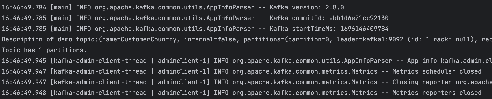
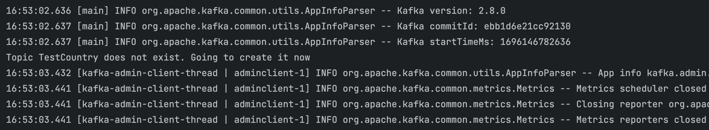
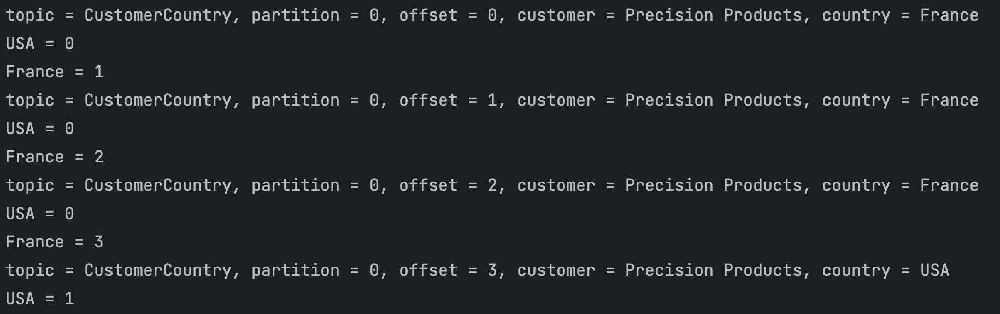
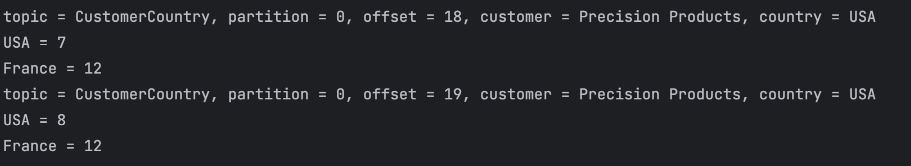

# 5. 프로그램 내에서 코드로 카프카 관리하기

# 5.1 AdminClient 개요

### **최종적 일관성과 AdminClient**

1. **비동기 연산:**
    - `AdminClient`의 많은 메서드는 비동기로 동작하며 `KafkaFuture`를 반환한다. 이는 작업이 즉시 완료되지 않고, 백그라운드에서 실행됨을 의미한다.
    - `KafkaFuture.get()` 메서드를 호출하여 작업의 완료를 대기할 수 있다. 그러나 이 작업이 완료되었다고 해서 클러스터의 모든 노드에 즉시 반영되는 것은 아니다.
2. **최종적 일관성:**
    - Kafka는 최종적 일관성 모델을 따른다. 예를 들어, 토픽을 생성하거나 구성을 변경한 후, 이 변경이 모든 노드에 즉시 반영되지 않을 수 있다.
    - 변경이 일어난 후 일정 시간이 지나면, 클러스터의 모든 노드가 일관된 상태가 된다.
3. **일관성 확인:**
    - `AdminClient`를 사용할 때는, 연산이 완료된 후 클러스터가 일관된 상태가 될 때까지 기다려야 할 수 있다.
    - 예를 들어, 새 토픽을 생성한 후에는 토픽이 모든 노드에서 사용 가능해질 때까지 약간의 지연이 발생할 수 있다.

### 옵션

AdminClient의 각 메서드는 메서드별로 특정한 Options 객체를 인수로 받는다.

### 추가 참고 사항

- 클러스터의 상태를 변경하는 모든 작업은 컨트롤러에 의해 수행된다.
- 클러스터 상태를 읽기만 하는 작업은 아무 브로커에서나 수행될 수 있으며, 클라이언트 입장에서 보이는 가장 부하가 적은 브로커로 전달된다.

---

# 5.2 AdminClient 사용법 : 생성, 설정, 닫기

```java
Properties props = new Properties();
props.put(AdminClientConfig.BOOTSTRAP_SERVERS_CONFIG, "localhost:9092");
AdminClient admin = AdminClient.create(props);
admin.close(Duration.ofSeconds(30));
```

- close를 호출하면, 클라이언트는 타임아웃이 만료될 때까지 응답을 기다린다.

## AdminClient 설정 매개변수

### client.dns.lookup

- 카프카는 부트스트랩 서버 설정에 포함된 호스트명을 기준으로 연결을 검증하고, 해석하고, 생성한다.
1. **DNS 별칭 사용 시:**
    - 모든 브로커를 대상으로 하는 단일 DNS 별칭 생성이 가능하다.
    - SASL 인증 시, 호스트명 불일치로 인해 문제가 발생할 수 있다.
    - 호스트명 불일치는 중간자 공격의 가능성을 의미하므로, SASL 인증이 거부되며 연결이 실패한다.
    
    **해결책:**
    
    - `client.dns.lookup` 설정을 `resolve_canonical_bootstrap_servers_only`로 지정하여 이 문제를 해결할 수 있다.
2. 다수의 IP 주소로 연결되는 DNS 이름을 사용하는 경우
    - `use_all_dns_ips` 옵션을 사용하면, 클라이언트는 DNS 조회를 통해 반환된 모든 IP 주소를 사용하여 부트스트랩 서버에 연결을 시도한다.

### request.timeout.ms

애플리케이션이 AdminClient의 응답을 기다릴 수 있는 시간의 최대값을 정의한다.

---

# 5.3 필수적인 토픽 관리 기능

토픽 목록 조회, 상세 내역 조회, 생성 및 삭제

### 토픽 목록 조회하기

```java
ListTopicResult topics = admin.listTopics();
topics.names().get().forEach(System.out::println);
```

### 토픽 존재 여부 확인 및 생성

```java
Properties props = new Properties();
props.put(AdminClientConfig.BOOTSTRAP_SERVERS_CONFIG, "localhost:9092, localhost:9093, localhost:9094");

// 2. AdminClient 생성 및 사용
try (AdminClient admin = AdminClient.create(props)) {

    // 3. 토픽 리스트 조회
    ListTopicsResult topics = admin.listTopics();
    Set<String> topicNames = topics.names().get();

    String targetTopic = "TestCountry";
    Integer numOfPartitions = 1;
    Short rep_factor = 2;

    DescribeTopicsResult demoTopic = admin.describeTopics(topicNames);
    try {
				// 특정 토픽 존재 여부 확인
        TopicDescription topicDescription = demoTopic.values().get(targetTopic).get();
        System.out.println("Description of demo topic:" + topicDescription);

        if (topicDescription.partitions().size() != numOfPartitions) {
            System.out.println("Topic has wrong number of partitions. Exiting.");
            System.exit(-1);
        } else {
            System.out.printf("Topic has %d partitions.\n", topicDescription.partitions().size());
        }
    } catch (Exception e) {
        System.out.println("Topic " + targetTopic +
                " does not exist. Going to create it now");

        // 새로운 토픽 생성
        CreateTopicsResult newTopic = admin.createTopics(Collections.singletonList(
                new NewTopic(targetTopic, numOfPartitions, rep_factor)));

        // 토픽이 제대로 생성됐는지 확인한다.
        if(newTopic.numPartitions(targetTopic).get() != numOfPartitions) {
            System.out.println("Topic has wrong number of partitions. Exiting.");
            System.exit(-1);
        }
    }
} catch (InterruptedException | ExecutionException e) {
    // 예외 처리 로직
    e.printStackTrace();
}
```

📌 특정 토픽 정보 출력



📌 새로운 토픽 생성



---

# 5.4 설정 관리

설정 관리는 ConfigResource 객체를 사용해서 할 수 있다.

설정 가능한 자원에는 브로커, 브로커 로그, 토픽이 있다.

```java
ConfigResource configResource = 
									new ConfigResource(ConfigResource.Type.TOPIC, "CustomerCountry");

DescribeConfigsResult configsResult = admin.describeConfigs(Collections.singleton(configResource));
Config config = configsResult.all().get().get(configResource);
System.out.println(config.entries().stream().filter(entry -> entry.name().equals("cleanup.policy")).collect(Collectors.toList()));

config.entries().stream().filter(
        entry -> !entry.isDefault()).forEach(System.out::println);

ConfigEntry compaction = new ConfigEntry(TopicConfig.CLEANUP_POLICY_CONFIG,
        TopicConfig.CLEANUP_POLICY_COMPACT);

if (!config.entries().contains(compaction)) {
    Collection<AlterConfigOp> configOp = new ArrayList<AlterConfigOp>();
    configOp.add(new AlterConfigOp(compaction, AlterConfigOp.OpType.SET));
    Map<ConfigResource, Collection<AlterConfigOp>> alterConf = new HashMap<>();
    alterConf.put(configResource, configOp);
    admin.incrementalAlterConfigs(alterConf).all().get();
}
```

- `configResource` (변경 대상 토픽)을 키로, `configOp` (설정 변경 작업들의 컬렉션)을 값으로 하는 맵 `alterConf`를 생성한다.
- 각각의 설정 변경 작업은 설정 항목과 작업 유형으로 이루어진다.
    - `SET`: 설정 값을 설정하거나 변경한다.
    - `DELETE`: 설정 값을 삭제한다.
    - `APPEND`: 리스트 형태의 설정 값에 추가한다.
    - `SUBTRACT`: 리스트 형태의 설정 값에서 제거한다.
    
---

# 5.5 컨슈머 그룹 관리

AdminClient를 사용해서 프로그램적으로 컨슈머 그룹과 이 그룹들을 커밋한 오프셋을 조회하고 수정하는 방법에 대해 살펴본다.

## 컨슈머 그룹 살펴보기

### 컨슈머 그룹의 목록 조회하기

```java
admin.listConsumerGroups().valid().get().forEach(System.out::println);
```

### 각 파티션의 마지막 커밋된 오프셋 값 조회하기

```java
// 토픽 파티션을 키로 각각 토픽 파티션에 대해 마지막으로 커밋된 오프셋을 벨류로 하는 맵을 가져온다.
Map<TopicPartition, OffsetAndMetadata> offsets =
        admin.listConsumerGroupOffsets("CountryCounter")
                .partitionsToOffsetAndMetadata().get();
Map<TopicPartition, OffsetSpec> requestLatestOffsets = new HashMap<>();

// 각각의 토픽 파티션에 대해 마지막 메시지의 오프셋을 얻는다.
for (TopicPartition tp: offsets.keySet()) {
    requestLatestOffsets.put(tp, OffsetSpec.latest());
}

Map<TopicPartition, ListOffsetsResult.ListOffsetsResultInfo> latestOffsets =
        admin.listOffsets(requestLatestOffsets).all().get();

// 모든 파티션을 반복해서 각각의 파티션에 대해 마지막으로 커밋된 오프셋, 파티션의 마지막 오프셋, 둘 사이의 랙을 출력한다.
for (Map.Entry<TopicPartition, OffsetAndMetadata> e : offsets.entrySet()) {
    String topic = e.getKey().topic();
    int partition = e.getKey().partition();
    long committedOffset = e.getValue().offset();
    long latestOffset = latestOffsets.get(e.getKey()).offset();
    System.out.println("Consumer group " + "CountryCounter \n"
            + " topic : " + topic
            + " partition : " + partition
            + " latestOffset - committedOffset = " + (latestOffset - committedOffset)) ;
}
```

## 컨슈머 그룹 수정하기

📌 오프셋 토픽의 오프셋 값을 변경한다 해도 컨슈머 그룹에 변경 여부가 전달되지는 않는다.

⇒ 컨슈머 그룹은 컨슈머가 새로운 파티션을 할당받거나 새로 시작할 때만 오프셋 토픽에 저장된 값을 읽어온다.

📌 상태를 가지고 있는 컨슈머 애플리케이션에서 오프셋을 리셋하고, 해당 컨슈머 그룹이 토픽의 맨 처음부터 처리를 시작하도록 할 경우 저장된 상태가 깨질 수 있다.

⇒ 개발 환경이라면 상태 저장소를 완전히 삭제한 다음 입력 토픽의 시작점으로 오프셋을 리셋해주어야 한다.

```java
// Admin 객체를 사용하여 "CountryCounter" 컨슈머 그룹의 현재 오프셋 정보를 가져옵니다.
Map<TopicPartition, OffsetAndMetadata> offsets =
        admin.listConsumerGroupOffsets("CountryCounter")
                .partitionsToOffsetAndMetadata().get();

// 가져온 오프셋 정보를 출력합니다.
offsets.forEach((key, value) -> System.out.println("key : "+ key + " value : " + value));

// 각 파티션에 대해 "earliest" offset 요청을 준비하기 위한 Map을 생성합니다.
Map<TopicPartition, OffsetSpec> requestEarliestOffsets = new HashMap<>();

// 각 파티션에 대해 "earliest" offset을 요청하는 OffsetSpec 객체를 맵에 추가합니다.
for (TopicPartition tp : offsets.keySet()) {
    requestEarliestOffsets.put(tp, OffsetSpec.earliest());
}

// 생성한 맵을 사용하여 각 파티션의 "earliest" offset을 조회합니다.
Map<TopicPartition, ListOffsetsResult.ListOffsetsResultInfo> earliestOffsets =
        admin.listOffsets(requestEarliestOffsets).all().get();

// 조회된 "earliest" offset 정보를 출력합니다.
earliestOffsets.forEach((key, value) -> System.out.println("key : "+ key + " value : " + value));

// 컨슈머 그룹의 오프셋을 리셋하기 위한 OffsetAndMetadata 객체를 준비합니다.
Map<TopicPartition, OffsetAndMetadata> resetOffsets = new HashMap<>();
for (Map.Entry<TopicPartition, ListOffsetsResult.ListOffsetsResultInfo> e : earliestOffsets.entrySet()) {
    // 각 파티션에 대해 리셋할 오프셋 값을 Map에 저장합니다.
    resetOffsets.put(e.getKey(), new OffsetAndMetadata(e.getValue().offset()));
}

try {
    // "CountryCounter" 컨슈머 그룹의 오프셋을 준비한 값으로 리셋합니다.
    admin.alterConsumerGroupOffsets("CountryCounter", resetOffsets).all().get();
} catch (ExecutionException e) {
		// 오프셋 업데이트 작업이 실패한 경우, 오류 메시지를 출력합니다.
    System.out.println("Failed to update the offsets committed by group CountryCounter with error " + e.getMessage() );
}
```

✅ consumer가 offset 0부터 다시 값을 읽어오는 것을 볼 수 있었음.




---

# 5.6 클러스터 메타데이터

클러스터 정보를 읽어와야 하는 경우는 드물다.

```java
DescribeClusterResult cluster = admin.describeCluster();

System.out.println("Connected to cluster " + cluster.clusterId().get());
System.out.println("The brokers in the cluster are: ");
cluster.nodes().get().forEach(node -> System.out.println("* " + node));
System.out.println("The controller is: " + cluster.controller().get());
```

---

# 5.7 고급 어드민 작업

## 토픽에 파티션 추가하기

```java
Map<String, NewPartitions> newPartitions = new HashMap<>();
newPartitions.put(TOPIC_NAME, NewPartitions.increaseTo(NUM_PARTITIONS+2));
admin.createPartitions(newPartitions).all().get();
```

토픽을 확장할 때는 새로 추가될 파티션 수가 아닌 파티션이 추가된 뒤의 파티션 수를 지정해야한다.

## 토픽에서 레코드 삭제하기

deleteRecords 메서드는 호출 시점을 기준으로 지정된 오프셋보다 더 오래된 모든 레코드에 삭제 표시를 함으로써 컨슈머가 접근할 수 없도록 한다.

```java
// 생성한 맵을 사용하여 각 파티션의 "earliest" offset을 조회합니다.
Map<TopicPartition, ListOffsetsResult.ListOffsetsResultInfo> olderOffsets =
        admin.listOffsets(requestOlderOffsets).all().get();

Map<TopicPartition, RecordsToDelete> recordsToDelete = new HashMap<>();
for (Map.Entry<TopicPartition, ListOffsetsResult.ListOffsetsResultInfo> e : olderOffsets.entrySet()) 
    recordsToDelete.put(e.getKey(), recordsToDelete.beforeOffset(e.getValue().offset()));

admin.deleteRecords(recordsToDelete).all().get();
```

## 리더 선출

### 선호 리더 선출

- 각 파티션은 선호 리더라 불리는 레플리카를 하나씩 가진다.
- 모든 파티션이 선호 리더 레플리카를 리더로 삼을 경우 각 브로커마다 할당되는 리더의 개수가 균형을 이룬다.
- 카프카는 주기적으로 선호 리더 레플리카가 실제로 리더를 맡고 있는지를 확인해서 리더를 맡고 있지 않은 경우 해당 레플리카를 리더로 삼는다.

### 언클린 리더 선출

- 리더가 될 수 없는 레플리카를 그냥 리더로 삼아버린다.
- 예전에 리더에 쓰여졌지만 새 리더로 복제되지 않은 모든 이벤트는 유실된다.

```java
Set<TopicPartition> electableTopics = new HashSet<>();
electableTopics.add(new TopicPartition(TOPIC_NAME, 0));

try {
	admin.electLeaders(ElectionType.PREFERRED, eleactableTopics).all().get();
} catch (ExecutionException e) {
	if (e.getCause() instanceof ElectionNotNeededException) {
		System.out.println("All leaders are preferred already"):
	}
}
```

## 레플리카 재할당

레플리카의 현재 위치가 마음에 안들 때 alterPartitionReassignments를 사용하면 파티션에 속한 각각의 레플리카의 위치를 정밀하게 제어할 수 잇다.

📌 레플리카를 하나의 브로커에서 다른 브로커로 재할당하는 일은 브로커 간에 대량의 데이터 복제를 초래한다.

```java
// reassign partitions to new broker
Map<TopicPartition, Optional<NewPartitionReassignment>> reassignment = new HashMap<>();
reassignment.put(new TopicPartition(TOPIC_NAME, 0),
        Optional.of(new NewPartitionReassignment(Arrays.asList(0,1))));
reassignment.put(new TopicPartition(TOPIC_NAME, 1),
        Optional.of(new NewPartitionReassignment(Arrays.asList(1))));
reassignment.put(new TopicPartition(TOPIC_NAME, 2),
        Optional.of(new NewPartitionReassignment(Arrays.asList(1,0))));
reassignment.put(new TopicPartition(TOPIC_NAME, 3),Optional.empty());
try {
    admin.alterPartitionReassignments(reassignment).all().get();
} catch (ExecutionException e) {
    if (e.getCause() instanceof NoReassignmentInProgressException) {
        System.out.println("We tried cancelling a reassignment that was not happening anyway. Lets ignore this.");
    }
}

System.out.println("currently reassigning: " +
        admin.listPartitionReassignments().reassignments().get());
demoTopic = admin.describeTopics(TOPIC_LIST);
topicDescription = demoTopic.values().get(TOPIC_NAME).get();
System.out.println("Description of demo topic:" + topicDescription);
```

- `TOPIC_NAME` 토픽의 `0`번 파티션은 `0`과 `1` 브로커에 할당된다.,
- `1`번 파티션은 `1` 브로커에만 할당된다.
- `2`번 파티션은 `1`과 `0` 브로커에 할당된다. 새로운 레플리카로 리더가 바뀌게 된다.
- `3`번 파티션에 대해서는 `Optional.empty()`가 사용되어 특별한 재할당이 설정되지 않았다.

---

# 5.8 테스트하기

아파치 카프카는 원하는 수만큼의 브로커를 설정해서 초기화할 수 있는 MockAdminClient 테스트 클래스를 제공한다.
```java
@Before
public void setUp() {
    Node broker = new Node(0,"localhost",9092);
    this.admin = spy(new MockAdminClient(Collections.singletonList(broker), broker));

    // without this, the tests will throw `java.lang.UnsupportedOperationException: Not implemented yet`
    AlterConfigsResult emptyResult = mock(AlterConfigsResult.class);
    doReturn(KafkaFuture.completedFuture(null)).when(emptyResult).all();
    doReturn(emptyResult).when(admin).incrementalAlterConfigs(any());
}
```

```java
@Test
public void testCreateTestTopic() throws ExecutionException, InterruptedException {
    TopicCreator tc = new TopicCreator(admin);
    tc.maybeCreateTopic("test.is.a.test.topic");
    verify(admin, times(1)).createTopics(any());
}

@Test
public void testNotTopic() throws ExecutionException, InterruptedException {
    TopicCreator tc = new TopicCreator(admin);
    tc.maybeCreateTopic("not.a.test");
    verify(admin, never()).createTopics(any());
}
`