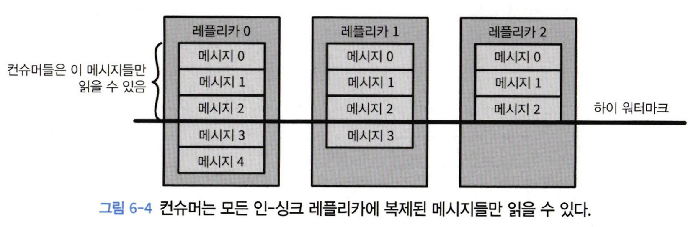

# 6. 카프카 내부 메커니즘

```
- 카프카 컨트롤러
- 카프카에서 복제가 작동하는 방식
- 카프카가 프로듀서와 컨슈머의 요청을 처리하는 방식
- 카프카가 저장을 처리하는 방식
```

---

# 6.1 클러스터 멤버십

- 각 브로커는 브로커 설정 파일에 정의되었거나 아니면 자동으로 생성된 고유한 식별자를 가진다.
- 브로커 프로세스는 시작될 때마다 주키퍼에 **Ephemeral 노드의 형태로 ID**를 등록한다.
    - 브로커와 주키퍼 간의 연결이 끊어질 경우 **Ephemeral 노드**는 자동으로 주키퍼에서 삭제된다.
- 브로커들과 생태계 툴들은 브로커가 등록되는 주키퍼의 /brokers/ids 경로를 구독함으로써 브로커가 추가되거나 제거될 때마다 알림을 받는다.

---

# 6.2 컨트롤러

### 생성 및 삭제

- 클러스터에서 가장 먼저 시작되는 브로커는 주키퍼의 /controller에 Ephermeral 노드를 생성함으로써 컨트롤러가 된다.
    - 컨트롤러 브로커가 멈추거나 주키퍼와의 연결이 끊어질 경우, Ephemeral 노드는 삭제된다.
- 브로커는 주키퍼의 컨트롤러 노드에 변동이 생겼을 때 알림을 받기 위해서 이 노드에 와치를 설정한다.

### 새로운 컨트롤러 선출

- 컨트롤러는 서로 다른 2개의 브로커가 현재 컨트롤러라 생각하는 “스플릿 브레인”현상을 방지하기 위해 에포크 번호를 사용한다.
    - 브로커는 새로운 컨트롤러가 선출될 때마다 주키퍼의 조건적 증가 연산에 의해 증가된 에포크를 전달받는다.
    - 브로커는 더 낮은 에포크 값(예전 값)을 가진 컨트롤러로 부터 메시지를 받을 경우 무시한다.
- 브로커가 컨트롤러가 되면, 클러스터 메타데이터 관리와 리더 선출을 시작하기 전에 주키퍼로부터 최신 레플리카 상태 맵을 읽어온다.
    - 적재 작업은 비동기 API를 사용해 수행되며 지연을 줄이기 위해 읽기 요청을 여러 단계로 나눠서 주키퍼로 보낸다.

### 브로커 캐시 관리 방법

- 클러스터 안의 모든 브로커는 클러스터 내 전체 브로커와 레플리카 맵을 포함하는 MetadataCache를 가지고 있다.
    - MetadataCache는 인메모리로 관리되기 때문에, 브로커가 시작되면, 현재 클러스터의 상태와 메타데이터를 가져와 **`MetadataCache`**를 업데이트한다.
- 컨트롤러는 모든 브로커에 리더십 변경 정보를 포함하는 UpdateMetadata 요청을 보내서 각각의 캐시를 업데이트 하도록 한다.

### 브로커 삭제 시 메커니즘

- 컨트롤러는 브로커가 클러스터에 추가되거나 제거될 때 파티션과 레플리카 중에서 리더를 선출할 책임을 진다.
- 브로커가 클러스터를 나갔다는 사실을 컨트롤러가 알아차리면, 컨트롤러는 해당 브로커가 리더를 맡고 있었던 모든 파티션에 대해 새로운 브로커를 할당해주게 된다.
    - 새로운 상태를 주키퍼에 쓴 뒤, 새로 리더가 할당된 파티션의 래플리카를 포함하는 모든 브로커에 LeaderAndISR 요청을 보낸다. ( 해당 파티션에 대한 새로운 리더와 팔로워 정보 포함 )

## 6.2.1 KRaft : 카프카의 새로운 래프트 기반 컨트롤러

### 💡 핵심 아이디어

카프카 그 자체에 사용자가 상태를 이벤트 스트림으로 나타낼 수 있도록 하는 **로그 기반 아키택처**를 도입한다.


### 래프트 알고리즘

- 래프트 알고리즘을 사용함으로써 컨트롤러 노드들은 외부 시스템에 의존하지 않고 자체적으로 리더를 선출할 수 있게 된다.
- 액티브 컨트롤러 : 메타데이터 로그의 리더 역할을 맡고 있는 컨트롤러
    - 브로커가 보내온 모든 RPC 호출을 처리한다.
- 팔로워 컨트롤러
    - 액티브 컨트롤러에 쓰여진 데이터를 복제한다.
    - 액티브 컨트롤러에 장애가 발생했을 시에 즉시 투입될 수 있도록 준비 상태를 유지한다.

### 동작 방식

- 브로커들이 새로 도입된 MetadataFetch API를 사용해서 액티브 컨트롤러로부터 변경 사항을 가져온다.
    - 브로커는 마지막으로 가져온 메타데이터 변경 사항의 오프셋을 추적하고 그보다 나중 업데이트만 컨트롤러에 요청한다.
    - 메타데이터를 **디스크**에 저장한다.
- 브로커 프로세스는 시작시 주키퍼가 아닌 컨트롤러 쿼럼에 등록한다.
- 브로커가 종료되면 오프라인 상태로 들어가는 것일 뿐 등록은 여전히 유지된다. ( **fenced state** )


---

# 6.3 복제

개별적인 노드에 필연적으로 장애가 발생할 수밖에 없어 카프카는 **신뢰성과 지속성**을 보장하기 위해 복제를 수행한다.

## 레플리카 종류

### **1. 리더 레플리카 (Leader Replica):**

- **역할:**
    - 각 파티션에는 하나의 "리더 레플리카"가 존재한다.
    - 이 레플리카는 해당 파티션의 읽기와 쓰기 요청을 처리한다.
    - 클라이언트가 데이터를 쓰거나 읽을 때, 해당 요청은 파티션의 리더 레플리카로 전송된다.
- **위치:**
    - 리더 레플리카는 클러스터의 어느 브로커에나 위치할 수 있다.
    - 브로커 장애 또는 유지보수를 대비하여 리더의 역할은 다른 레플리카로 이동될 수 있다.

### **2. 팔로워 레플리카 (Follower Replica):**

- **역할:**
    - "팔로워 레플리카"는 "리더 레플리카"의 복제본을 유지한다.
    - 팔로워는 리더로부터 데이터를 복제받아, 데이터의 일관성과 내구성을 보장한다.
    - 팔로워 레플리카는 클라이언트의 읽기/쓰기 요청을 직접 처리하지 않는다. 대신, 리더와의 데이터 동기화에 집중한다.
- **위치:**
    - 팔로워 레플리카도 클러스터의 어느 브로커에나 위치할 수 있다.
    - 리더가 실패할 경우, 팔로워 중 하나가 새 리더로 선출될 수 있다.

### **3. 동작 원리:**

- **데이터 쓰기:**
    - 클라이언트가 데이터를 쓸 때, 그 데이터는 먼저 리더 레플리카에 기록된다.
    - 리더는 이 데이터를 팔로워 레플리카들에게 전송한다.
    - 팔로워들이 데이터를 받아 로컬에 기록한 후, 리더에게 ack를 보낸다.
- **데이터 읽기:**
    - 클라이언트의 읽기 요청은 리더 레플리카로 전송된다.
    - 리더는 요청된 데이터를 클라이언트에게 반환한다.

### **4. ISR (In-Sync Replica):**

- ISR은 리더 레플리카와 동기화된 상태의 팔로워 레플리카를 의미한다.
- 리더 레플리카가 실패하면, ISR 목록에 있는 팔로워 레플리카 중 하나가 새로운 리더로 선출된다.

### 선호 리더 (preferred leader)

- 토픽이 처음 생성되었을 때 리더 레플리카였던 레플리카를 가리킨다.
- auto.leader.rebalance.enable=true
    - 선호 리더가 현재 리더가 아니지만, 현재 리더와 동기화 되고 있을 경우 리더 선출을 진행시킴으로써 선호 리더를 현재 리더로 만들어 준다.

---

# 6.4 요청 처리

클라이언트는 연결을 시작하고 요청을 전송하며, 브로커는 요청을 처리하고 클라이언트로 응답을 보낸다.

특정 클라이언트가 브로커로 전송한 모든 요청은 브로커가 받은 순서대로 처리된다.

## 브로커 내부 요청 처리 방식

- acceptor thread
    - 브로커는 연결을 받는 각 포트별로 acceptor thread를 하나씩 실행시킨다.
    - acceptor thread는 연결을 생성하고 들어온 요청을 processor thread에 넘겨 처리하도록 한다.
- processor thread (= network thread)
    - 클라이언트 연결로 부터 들어온 요청들을 받아서 요청 큐에 넣는다.
    - 응답 큐에서 응답을 가져다 클라이언트로 보낸다.
- I/O thread
    - 요청이 요청 큐에 들어오면 I/O 스레드가 요청을 가져와서 처리하는 일을 담당한다.
    - 요청 유형
        - 쓰기 요청 : 카프카 브로커로 메시지를 쓰고 있는 프로듀서가 보낸 요청
        - 읽기 요청 : 카프카 브로커로부터 메시지를 읽어오고 있는 컨슈머나 팔로워 레플리카가 보낸 요청
        - 어드민 요청 : 토픽 생성이나 삭제와 같이 메타데이터 작업을 수행중인 어드민 클라이언트가 보낸 요청
- 지연된 응답들은 퍼거토리에 저장된다.


### 클라이언트가 리더 레플리카를 확인하는 방법

- 카프카 클라이언트는 메타데이터 요청을 통해 리더 레플리카를 확인한다.
- 메타데이터 요청는 토픽, 파티션, 리더 레플리카 등에 대한 정보를 포함하는 응답을 리턴한다.
- 모든 브로커는 메타데이터 캐시를 가지고 있어 아무 브로커에 메타데이터 요청을 보낼 수 있다.


## 쓰기 요청

### acks

- acks=1 : 리더만이 메시지를 받았을 때
- acks=all : 모든 인-싱크 레플리카들이 메시지를 받았을 때
    - 요청을 퍼거토리라 블리는 버퍼에 저장한다.
    - 팔로워 레플리카들이 메시지를 복제한 것 확인한 후 클라이언트에 응답을 보낸다.
- acks=0 : 메시지가 보내졌을 때. 즉, 브로커의 응답을 기다리지 않음

### 쓰기 요청 과정

1. 유효성 검증
    - 리더 레플리카를 가진 브로커가 쓰기 요청을 받으면 유효성 검증을 수행한다.
2. 메시지 저장
    - 브로커는 새 메시지들을 로컬 디스크에 쓴다.
    - 리눅스의 경우, 파일시스템 캐시에 쓰여지는데 언제 디스크에 반영될지 보장되지 않는다.
    

## 읽기 요청

### 읽기 요청 과정

1. 클라이언트 요청
    - 클라이언트는 브로커에 토픽, 파티션 그리고 오프셋 목록에 해당하는 메시지들을 보내 달라는 요청을 보낸다.
2. 유효성 검증
    - 파티션 리더는 요청이 유효한지 확인한다.
3. 메시지 전송
    - 만약 오프셋이 존재한다면, 브로커는 파티션으로부터 클라이언트가 요청에 지정한 크기 한도만큼의 메시지를 읽어서 클라이언트에게 보내 준다.
    - zero-copy 최적화
        - 파일에서 읽어 온 메시지들을 중간 버퍼를 거치지 않고 바로 네트워크 채널로 보낸다.


### 인-싱크 레플리카

- 컨슈머는 모든 인-싱크 레플리카에 복제된 메시지들만 읽을 수 있다.
- [replica.lag.time.max.ms](http://replica.lag.time.max.ms) : 레플리카가 새 메시지를 복제하는 과정에서 지연될 수 있는 최대 시간



### 읽기 세션 캐시

- 컨슈머는 읽고 있는 파티션의 목록과 그 메타데이터를 캐시하는 세션을 생성할 수 있다.
- 세션이 한 번 생성되면, 컨슈머들은 더 이상 요청을 보낼 때마다 모든 파티션을 지정할 필요가 없다.
- 브로커는 변경 사항이 있는 경우에만 응답에 메타데이터를 포함한다.

---

# 6.5 물리적 저장소

카프카의 기본 저장 단위는 파티션 레플리카이다.

- 파티션의 크기는 특정 마운트 지점에 사용 가능한 공간에 제한을 받는다.
- 카프카를 설정할 때는 운영자가 파티션들이 저장될 디렉토리 목록을 정의한다. (log.dirs 매기변수)

## 6.5.1 계층화된 저장소

계층화된 저장소 기능에서는 카프카 클러스터의 저장소를 로컬과 원격, 두 계층으로 나눈다.

- 로컬 계층
    - 로컬 세그먼트를 저장하기 위해 브로커의 로컬 디스크를 사용한다.
- 원격 계층
    - 완료된 로그 세그먼트를 저장하기 위해 HDFS나 S3와 같은 전용 저장소 시스템을 사용한다.
    - 원격 계층에 저장되는 로그 세그먼트들은 원격 계층에서 바로 클라이언트로 전달된다.

## 6.5.2 파티션 할당

임의의 브로커부터 시작해서 각 브로커에 라운드 로빈 방식으로 파티션을 할당함으로써 리더를 결정한다.

### 랙이 있는 경우

랙 인식 기능을 고려할 때는 단순히 순서대로 브로커를 선택하는 대신, 서로 다른 랙의 브로커가 번갈아 선택되도록 순서를 정해야 한다.

### 파티션 저장 디렉토리 선정

- 각 디렉토리에 저장되어 있는 파티션의 수를 센 뒤, 가장 적은 파티션이 저장된 디렉토리에 새 파티션을 저장한다.

## 6.5.3 파일 관리

하나의 파티션을 여러 개의 세그먼트로 분할한다.

- 각 세그먼트 한도가 다 차면 세그먼트를 닫고 새 세그먼트를 생성한다.

### active segment

- 현재 쓰여지고 있는 세그먼트

## 6.5.4 파일 형식

각 세그먼트는 하나의 데이터 파일 형태로 저장된다.

- 파일 안에는 카프카의 메시지와 오프셋이 저장된다.

네트워크를 통해 전달되는 형식과 디스크에 저장되는 형식을 통일한다.

- 메시지 전송 시 zero-copy 최적화를 달성한다.

### 6.5.5 인덱스

카프카는 컨슈머가 임의의 사용 가능한 오프셋에서부터 메시지를 읽어오기 시작할 수 있도록 한다.

인덱스는 오프셋과 세그먼트 파일 및 그 안에서의 위치를 매핑한다.

- 인덱스도 세그먼트 단위로 분할된다.

### 6.5.6 압착

카프카는 설정된 기간 동안만 메시지를 저장하며, 보존 기간이 지나간 메시지들은 삭제한다.

삭제 보존 정책

- 지정된 보존 기한보다 더 오래된 이벤트들을 삭제한다.

압착 보존 정책

- 토픽의 각 키의 최근 값만 저장하도록 한다.

### 6.5.7 압착 작동 원리

로그의 두 영역

- 클린
    - 이전에 압착된 적이 있었던 메시지들이 저장된다.
- 더티
    - 마지막 압착 작업 이후 쓰여진 메시지들이 저장된다.


압착 스레드는 전체 파티션 크기 대비 더티 메시지의 비율이 가장 높은 파티션을 골라서 압착한 뒤 클린 상태로 만든다.

### **로그 압착 과정**

1. **로그 세그먼트 선택:**
    - Kafka는 로그 데이터를 여러 세그먼트 파일에 분할하여 저장한다..
    - 로그 압착이 수행되는 경우, Kafka는 압착 대상 세그먼트를 선택합니다. 일반적으로 오래된 세그먼트부터 압착이 수행된다..
2. **메시지 스캔:**
    - 선택된 세그먼트의 모든 메시지를 스캔한다..
    - 이 과정에서 각 메시지의 키를 확인하고, 해당 키의 가장 최신 메시지를 식별한다..
3. **중복 제거:**
    - 동일한 키를 가진 메시지 중, 가장 최신의 메시지만을 유지한다.
    - 오래된 메시지 (즉, 동일한 키를 가진 이전 메시지)는 삭제된다.
4. **새 세그먼트 작성:**
    - 압착된 메시지들로 새로운 로그 세그먼트를 작성한다..
    - 이 새로운 세그먼트는 압착된 데이터만 포함하며, 오래된 세그먼트를 대체한다.
5. **세그먼트 교체:**
    - 압착 작업이 완료된 후, 오래된 세그먼트는 새로운 (압착된) 세그먼트로 교체된다.
    - 오래된 세그먼트는 디스크에서 삭제된다.