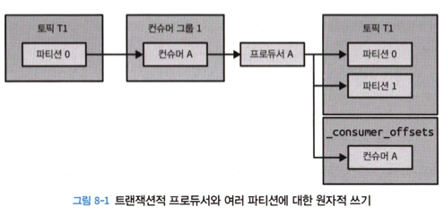
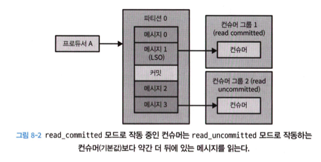
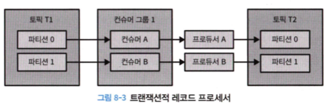
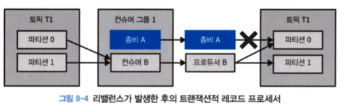

# 8. ‘정확히 한번’ 의미 구조

카프카의 ‘정확히 한 번’의미 구조는 두 개의 핵심 기능의 조합으로 이루어진다.

- 멱등성 프로듀서
    - 프로규서 재시도로 인해 발생하는 중복을 방지한다.
- 트랜잭션
    - 스트림 처리 애플리케이션에서 ‘정확한 한 번’ 처리 보장한다.

---

# 8.1 멱등성 프로듀서

동일한 작업을 여러 번 실행해도 한 번 실행한 것과 결과가 같은 서비스를 멱등적이라고 한다.

카프카의 멱등적 프로듀서 기능은 자동으로 이러한 중복을 탐지하고 처리함으로써 이 문제를 해결한다.

## 8.1.1 멱등적 프로듀서의 작동 원리

멱등적 프로듀서 기능을 켜면 모든 메시지는 고유한 프로듀서 ID와 시퀸스 넘버를 가지게 된다.

대상 토픽 및 파티션과 이 두 값을 합치면 각 메시지의 고유한 식별자가 된다.

- max.in.flights.requests.per.connection
    - 파티션별로 추적되어야 하는 시퀀스 넘버의 수를 제한하고 싶다면 5이하로 설정

브로커가 예전에 받은 적이 있는 메시지를 받게 될 경우, 적절한 에러를 발생시킴으로써 중복 메시지를 거부한다.

- 프로듀서 클라이언트
    - record-error-rate 지푯값
- 브로커
    - RequestMetrics 유형의 ErrorsPerSec 지푶값

### 프로듀서 재시작

멱등적 프로듀서 기능이 켜진 경우

- 프로듀서는 초기화 과정에서 카프카 브로커로부터 프로듀서 ID를 생성받는다.

트랜젝션 기능을 켜지 않는 경우

- 프로듀서를 초기화할 때마다 완전히 새로운 ID가 생성된다.
- 프로듀서에 장애가 발생해서 투입된 새 프로듀서가 기존 프로듀서가 이미 전송한 메시지를 다시 전송할 경우, 브로커는 메시지에 중복이 발생했을을 알차리지 못한다.

### 브로커 장애

- 만약 브로커 장애가 발생할 경우, 컨트롤러는 장애가 난 브로커가 리더를 맡고 있었던 파티션들에 대해 새 리더를 선출한다.
- 리더는 새 메시지가 쓰여질 때마다 **인-메모리** 프로듀서 상태에 저장된 최근 5개의 시퀀스 넘버를 업데이트한다.
- 팔로워 레플리카는 리더로 부터 새로운 메시지를 복제할 때마다 자체적인 **인-메모리 버퍼**를 업데이트한다.
- 리더가 다시 돌아온 경우
    - 브로커는 종료되거나 새 세그먼트가 생성될 때마다 프로듀서 상태에 대한 스냅샷을 파일 형태로 저장한다.
    - 현재 리더로부터 복제한 레코드를 사용해서 프로듀서 상태를 업데이트함으로써 최신 상태를 복구한다.

## 8.1.2 멱등적 프로듀서의 한계

카프카의 멱등적 프로듀서는 프로듀서의 내부 로직으로 인한 재시도가 발생할 경우 생기는 중복만을 방지한다.

- 동일한 메시지를 가지고 producer.send()를 두 번 호출하면 멱등적 프로듀서가 개입하지 않는 만큼 중복된 메시지가 생기게 된다.

💡 프로듀서 예외를 잡아서 애플리케이션이 직접 재시도하는 것보다는 프로듀서에 탑재된 재시도 메커니즘을 사용하는 것이 언제나 더 낫다.

## 8.1.3 멱등적 프로듀서 사용법

enable.idempotence=true

---

# 8.2 트랜잭션

트랜젝션 기능은 카프카 스트림즈를 사용해서 개발된 애플리케이션에 정확성을 보장하기 위해 도입되었다.

스트림 처리 애플리케이션이 정확한 결과를 산출하도록 하기 위해 각 입력 레코드는 **정확히 한 번**만 처리되어야 하며 그 처리 결과 역시 정확히 한 번만 반영되어야 한다.

카프카는 스트림 처리 애플리케이션의 기본 패턴인 **`‘읽기-처리-쓰기’ 패턴`**에서 사용하도록 개발되었다.

## 트랜젝션이 해결하는 문제

### 1. 애플리케이션 크래시로 인한 재처리

Q. 출력 토픽에는 이미 결과를 썼는데 입력 오프셋이 커밋되기 전에 애플리케이션이 크래시 나면 어떻게 될까?

A. 중복이 발생한다.

- 마지막으로 커밋된 오프셋에서부터 크래시가 난 시점까지, 애플리케이션에 의해 처리된 모든 레코드들은 다시 처리될 것이며, 결과 역시 출력 토픽에 다시 쓰여진다.

### 2. 좀비 애플리케이션에 발생하는 재처리

Q. 애플리케이션이 카프카로부터 레코드 배치를 읽어온 직후 뭔가를 하기 전에 멈추거나, 카프카로의 연결이 끊어진다면 어떻게 될까?

A. 해당 컨슈머에 할당되어 있던 파티션들은 컨슈머 그룹 내 다른 컨슈머들에게 재할당될 것이다.

- 그 사이 멈췄던 애플리케이션의 첫 번쨰 인스턴스가 다시 작동하고, 마지막으로 읽어 왔던 레코드 배치를 처리하고 결과를 출력 토픽에 쓴다.
- 좀비는 출력 토픽으로 데이터를 쓸 수 있으며 따라서 중복된 결과가 발생할 수 있다.

## 트랙젝션은 어떻게 정확히 한 번을 보장하는가?

`정확히 한 번` 처리라 함은 읽기, 처리, 쓰기 작업이 원자적으로 이루어진다는 의미다.

카프카 트랜젝션은 `원자적 다수 파티션 쓰기 기능`을 도입했다.

<aside>
💡 오프셋을 커밋하는 것과 결과를 쓰는 것은 둘 다 파티션에 메시지를 쓰는 과정을 수반한다.
</aside>



### 트랙잭선적 프로듀서

- 원자적 다수 파티션 쓰기를 수행하려면 트랜잭션적 프로듀서를 사용해야 한다.
- [transactional.id](http://transactional.id) 설정 : 프로듀서 재시작 후에도 동일한 프로듀서 식별
- initTransactions() 호출해 초기화

### 좀비 팬싱

- 애플리케이션의 좀비 인스턴스가 중복 프로듀서를 생성하는 것을 방지
- 카프카는 트랜잭선적 프로듀서가 initTransaction()를 호출하면 transactional.id에 해당하는 에포크 값을 증가시킨다.
- 같은 [transaction.id](http://transaction.id) & 에포크가 낮은 프로듀서가 메시지 전송, 트랜젝션 커밋, 트랜젝션 중단 요청을 보낼 경우 FenceProducer 에러가 발생하면서 거부된다.

### isolation.level 값 설정

- isolation.level 설정값을 잡아줌으로써 트랜젝션 기능을 써서 쓰여진 메시지들을 읽어오는 방식을 제어할 수 있다.
- read_committed
    - 커밋된 트랜젝션에 속한 메시지
    - 처음부터 트랜젝션에 속하지 않는 메시지
- read_uncommitted ( default )
    - 진행중이거나 중단된 트랜젝션을 포함
    - 모든 레코드

메시지 읽기 순서를 보장하기 위해 read_committed 모드에서는 아직 진행중인 트랜젝션이 처음으로 시작된 시점 (Last Stable Offset, LSO) 이후에 쓰여진 메시지는 리턴되지 않는다.



## 트랜잭션 사용법

트랜잭션 기능을 사용하는 가장 일반적이고도 권장되는 방법은 카프카 스트림즈에서 exactly-once 보장을 활성화하는 것이다.

카프카 스트림즈 애플리케이션에서 정확히 한 번 보장 기능을 활성화하려면 `processing.guarantee` 설정을 exactly_once이나 exactly_once_beta로 잡아주면 된다.

### 트랜잭션 사용하지 않는 경우

```java
Properties producerProps = new Properties();
ProducerProps.put(ProducerConfig.BOOTSTRAP_SERVERS_CONFIG, "localhost:9092");
ProducerProps.put(ProducerConfig.CLIENT_ID_CONFIG, "DemoProducer");
ProducerProps.put(ProducerConfig.TRANSACTIONAL_ID_CONFIG, transactionalId); // 1

producer = new KafkaProducer<>(producerProps);

Properties consumerProps = new Properties();
consumerProps.put(ConsumerConfig.BOOTSTRAP_SERVERS_CONFIG, "localhost:9092");
consumerProps.put(ConsumerConfig.GROUP_ID_CONFIG, groupId);
props.put(ConsumerConfig.ENABLE_AUTO_COMMIT_CONFIG, "false"); // 2
consumerProps.put(ConsumerConfig.ISOLATION_LEVEL_CONFIG, "read_committed"); // 3

consumer = new KafkaConsumer<>(consumerProps);
```

1. 프로듀서에 transactional.id를 설정해 줌으로써 다수의 파티션에 대해 원자적 쓰기가 가능한 트랜잭선적 프로듀서를 생성한다.
2. 트랜잭션의 일부가 되는 컨슈머는 오프셋을 직접 커밋하지 않으며 프로듀서가 트랜잭션 과정의 일부로서 오프셋을 쓴다. 따라서 오프셋 커밋 기능은 꺼야 한다.
3. 컨슈머 격리 수준을 read_committed로 설정한다. 컨슈머는 커밋된 트랜잭션 외에도 비 트랜잭션적 쓰기 역시 여진히 읽어온다.

```java
producer.initTransactions(); // 4

consumer.subscribe(Collections.singleton(inputTopic); // 5

while (true) {
	try {
		ConsumerRecords<Integer, String> records =
			consumer.poll(Duration.ofMillis(200));

		if (records.count() > 0) {
			producer.beginTransaction(); // 6
			for (ConsumerRecord<Integer, String> record: records) {
				ProducerRecord<Integer, String> customizeRecord = 
					transform(record);  // 7
				producer.send(customizeRecord);
			}
			Map<TopicPartition, OffsetAndMetadata> offsets = consumerOffsets();
			producer.sendOffsetsToTransaction(offsets, consumer.groupMetadata());
			p
	} catch ( ) {

	} catch ( ) {

	}
}
```

1. 트랜잭션적 프로듀서를 사용할 때 가장 먼저 해야 하는 것은 초기화 작업이다.
    - 트랜잭션 ID 등록
    - 에포크 값 증가
    - 같은 트랙잭션 ID를 사용하는 트랜잭션들 중단.
2. 트랜잭션에 컨슈머 그룹 정보 추가하고 좀비 펜싱 수행
    - 이 메서드를 사용할 때는 관련된 파티션이 할당 해제될 때마다 트랜잭션을 커밋해주는 것이 좋다.

1. 레코드를 처리한다.
2. 트랜잭션 작업 도중에 오프셋을 커밋해준다.
    - 결과 쓰기에 실패하더라도 처리되지 않은 레코드 오프셋이 커밋되지 않도록 보장해준다.
3. 트랜잭션 커밋 후 작업을 마무리한다.

## 트랜잭션 ID와 펜싱

아파치 카프카 2.5부터 트랜잭션 ID와 컨슈머 그룹 메타데이터를 함께 사용하는 펜싱을 도입하였다.

1. 각 컨슈머는 읽어온 레코드를 트랜잭션적 프로듀서에게 넘겨준다.
2. 프로듀서는 각각 토픽 T2의 파티션 0과 1에 결과물을 쓴다.



1. 컨슈머 A와 프로듀서 A가 포함된 애플리케이션 인스턴스가 좀비가 된다.
2. 컨슈머 B가 두 파티션으로부터의 레코드를 모두 처리하기 시작한다.
3. 프로듀서 B로부터의 트랜잭션은 다음 세대의 컨슈머 그룹에서 온 것이 명백하므로 문제없이 작업을 진행할 수 있다.
4. 프로듀서 A로부터의 트랜잭션은 이전 세대의 컨슈머 그룹에서 온 것이기 때문에 펜싱된다.



## 트랜잭션의 작동 원리

카프카 트랜잭션 기능의 기본적인 알고리즘은 찬디-램포트 스냅샷 알고리즘의 영향을 받았다.

- 통신 채널을 통해 마커라고 불리는 컨트롤 메시지를 보낸다.
- 마커의 도착을 기준으로 일관적인 상태를 결정한다.

카프카의 트랜잭션은 다수의 파티션에 대해 트랜잭션이 커밋되었거나 중단되었다는 것을 표시하기 위해 `마커 메시지`를 사용한다.

일부 파티션에만 커밋 메시지가 쓰여진 상태에서 프로듀서가 크래시 나면 어떻게 될까?

카프카 트랜잭션은 `2단계 커밋`과 `트랜잭션 로그`를 사용해서 이 문제를 해결한다.

1. 현재 진행중인 트랜잭션이 존재함을 로그에 기록한다. 연관된 파티션들 역시 함께 기록한다.
2. 로그에 커밋 혹은 중단 시도를 기록한다.
3. 모든 파티션에 트랜잭션 마커를 쓴다.
4. 트랜잭션이 종료되었음을 로그에 쓴다.

initTransaction()

- 프로듀서는 자신이 트랜잭션 프로듀서임을 트랜잭션 코디네이터 역할을 맡을 브로커에게 알린다.
- 각 브로커는 전체 프로듀서의 트랜잭션 코디네이터 역할을 나눠서 맡는다.
- 각 트랜잭션 ID의 트랜잭션 코디네이터는 트랜잭션 ID에 해당하는 트랜잭션 로그 파티션의 리더 브로커가 맡는다.

beginTransaction()

- 실제 트랜잭션을 시작한다.

sendOffsetsToTransaction()

- 이 함수를 호출하면, 트랜잭션 코디네이터로 오프셋과 컨슈머 그룹 ID가 포함된 요청이 전송된다.
- 트랜젝션 코디네이터는 컨슈머 그룹 ID를 사용해서 컨슈머 그룹 코드네이터를 찾은 뒤, 컨슈머 그룹이 보통 하는 것과 같은 방식으로 오프셋을 커밋한다.

commitTransaction()

- 현재 진행 중인 트랜잭션을 커밋하려면 이 함수를 호출한다.
- 트랜잭션 내의 모든 메시지와 오프셋은 원자적으로 커밋되며, 컨슈머들은 해당 메시지들을 보게 된다.

abortTransaction()

- 만약 트랜잭션 중 문제가 발생하거나 원치 않는 상태로 진행되었을 때, 이 함수를 호출하여 트랜잭션을 중단할 수 있다.
- 트랜잭션 내의 모든 메시지와 오프셋은 버려지며, 컨슈머들은 이 메시지들을 볼 수 없다.

<aside>
📌 트랜잭션 혹은 멱등적 프로듀서로부터 레코드를 전달받은 각 브로커는 메모리상에 프로듀서/트랜잭션 ID와 프로듀서가 전송한 마지막 배치 5개에 연관된 상태를 저장한다.

이 상태는 프로듀서가 정지하고 나서도 [transaction.id.expiration.ms](http://transaction.id.expiration.ms) 만큼 저장된다.

애플리케이션을 설계할 때 초기화 과정에서 오랫동안 유지되는 프로듀서 몇 개만 생성한 뒤 애플리케이션이 종료될 때까지 재사용하길 권장한다.

이것이 불가능하다면, [transactional.id.expiration.ms](http://transactional.id.expiration.ms) 설정 값을 낮춰 잡음으로써 트랜잭션 ID가 더 빨리 만료되도록 한다.

</aside>

---

# 8.3 트랜잭션 성능

트랙잭션은 프로듀서에 약간의 오버헤드를 발생시킨다.

- 트랜젝션 초기화와 커밋 요청은 동기적으로 작동하기 때문에 성공적으로 완료되거나, 실패하거나, 타임아웃되거나 할 때까지 어떤 데이터도 전송되지 않는다.

<aside>
💡 프로듀서에 있어서 트랜잭션 오버헤드는 트랜잭션에 포함된 메시지의 수와는 무관하다.

</aside>

컨슈머는 커밋 마커를 읽어오는 작업에 관련해서 약간의 오버헤드가 있다.

- read_committed 모드 컨슈머에서는 아직 완려되지 않은 트랜잭션 레코드들이 리턴되지 않는다.
- 트랜잭션 커밋 사이의 간격이 길어질수록 컨슈머는 메시지가 리턴될 때까지 더 오랫동안 기다려야 한다.
- 컨슈머는 아직 완려되지 않은 트랜잭션에 속하는 메시지들을 버퍼링할 필요가 없다.