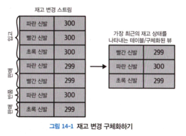
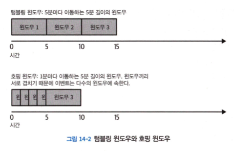
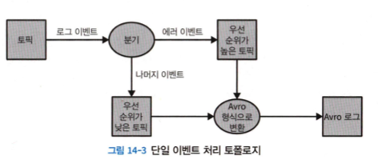
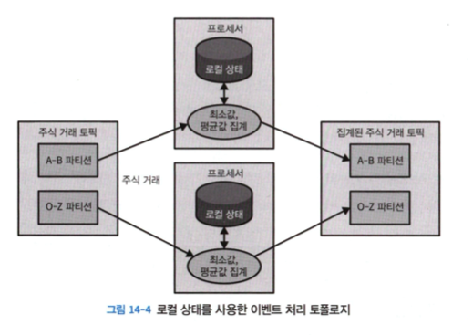
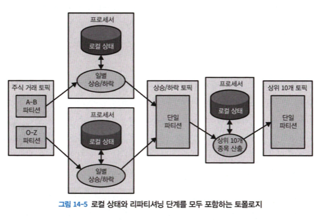
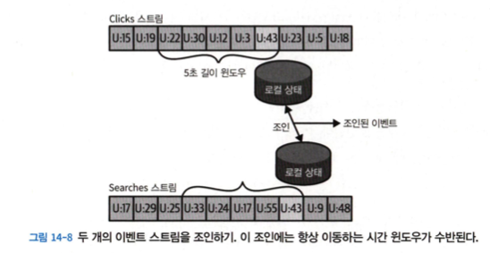
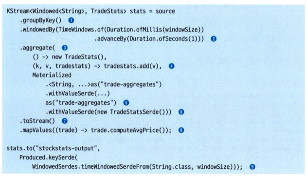
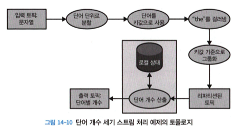
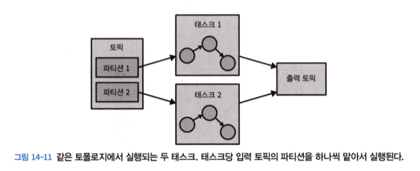
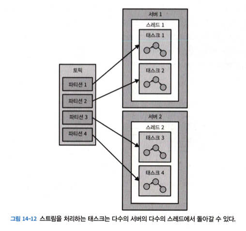

# 14. 스트림 처리

카프카 스트림즈는 카프카에서 공식적으로 제공하는 자바 라이브러리이다.

# 14.1 스트림 처리란 무엇인가?

### 데이터 스트림

- 무한히 늘어나는 데이터세트를 추상화한 것

### 이벤트 스트림 모델의 속성

- 이벤트 스트림에는 순서가 있다.
- 데이터 레코드는 불변하다.
    - 예를 들어 취소된 금융 거래는 사라지지 않는다. 대신, 기존 거래가 최소되었다는 의미의 추가적인 이벤트가 스트림에 쓰여진다.
- 이벤트 스트림은 재생이 가능하다.

### 프로그래밍 패러다임

스트림 처리란 하나 이상의 이벤트 스트림을 계속해서 처리하는 것을 의미한다. 스트림 처리는 요청-응답이나 배치 처리와 마친가지로 프로그래밍 패러다임 중 하나다.

- 요청-응답
    - 응답 시간이 1밀리초 미만 ~ 몇 밀리초 수준인 패러다임으로, 가장 지연이 적은 패러다임이다.
    - 처리 방식이 블로킹 방식이라 애플리케이션이 요청을 보낸 뒤 처리 시스템이 응답을 보내 줄 때까지 대기하는 것이 보통이다.
- 배치 처리
    - 사전 설정된 시각에 시작된다.
    - 필요한 모든 입력 데이터를 읽고, 모든 출력 데이터를 쓰고, 다음 번 실행 시간까지 대기한다.
    - 데이터베이스 세계에서 데이터 웨어하우스나 비즈니스 인텔리전스 시스템이 이러한 부류에 속한다.
- 스트림 처리
    - 연속적이고 논블로킹하게 작동하는 방식
    - 스트림 처리는 이벤트 처리에 2밀리초 정도 기다리는 응답-요청 방식과 하루 한 번 작업이 실행되고 완료하는데 8시간이 걸리는 배치 처리 사이의 격차를 메워준다.

---

# 14.2 스트림 처리 개념

## 토폴로지

스트림 처리 애플리케이션은 하나 이상의 처리 토폴로지를 포함한다.

하나 이상의 소스 스트림에서 시작된 이벤트 스트림은 연결된 스트림 프로세서들을 거쳐가면서 처리되다가 마지막에는 하나 이상의 싱크 스트림에 결과는 쓰는 것으로 끝나게 된다.

각각의 스트림 프로세서는 이벤트를 변환하기 위해 이벤트 스트림에 가해지는 연산 단계라고 할 수 있다.

## 시간

스트림 처리의 맥락에서, 대부분의 스트림 애플리케이션이 시간 윈도우에 대해 작업을 수행하는 만큼 시간에 대해 공통적인 개념을 가지는 것은 매우 중요하다.

### 이벤트 시간

- 다루고자 하는 이벤트가 발생하여 레코드가 생성된 시점
- 무엇인가 측정이 수행된 시각, 매장에서 상품이 팔린 시각, 사용자가 웹 페이지를 조회한 시각
- 만약 애플리케이션의 이벤트 시간 개념과 일치하지 않는다면, 레코드에 이벤트 시간을 가리키는 필드를 하나 추가함으로써 나중에 처리할 때 두 시간을 모두 활용할 수 있게 하는 방법을 권한다.
- 대부분의 경우 스트림 데이터를 처리할 때 가장 중요한 시간이 이벤트 시간이기 때문이다.

## 로그 추가 시간

- 이벤트가 카프카 브로커에 전달되어 저장된 시점

### 처리 시간

- 스트림 처리 애플리케이션이 연산을 수행하기 위해 이벤트를 받은 시간
- 매우 신뢰성이 떨어지며 가능하면 피하는 것이 좋다.

카프카 스트림즈는 TimestampExtractor 인터페이스를 사용하여 각각의 이벤트에 시간을 부여한다.

카프카 스트림즈를 사용하는 개발자는 이 인터페이스의 서로 다른 구현체를 사용함으로써 세 가지 시간 개념 중 하나를 사용하거나 아니면 이벤트 내용에서 타임스탬프를 결정하는 등 완전히 다른 시간 개념을 사용할 수도 있다.

카프카 스트림즈가 결과물을 카프카 토픽에 쓸 때, 다음과 같은 규칙에 따라서 이벤트에 타임스탬프를 부여한다.

- 결과 레코드가 입력으로 주어진 레코드에 직접적으로 대응될 경우, 결과 레코드는 입력 레코드와 동일한 타임스탬프를 사용한다.
- 결과 레코드가 집계 연산의 결과물일 경우, 집계에 사용된 레코드의 타임스탬프의 최대 값을 결과 레코드의 타임스탬프로 사용한다.
- 결과 레코드가 두 스트림을 조인한 결과일 경우, 조인된 두 레코드 타임스탬프 중 큰 쪽의 타임스탬프를 결과 레코드의 타임스탬프로 사용한다. 스트림 레코드 쪽의 타임스탬프가 사용된다.
- 마지막으로 punctuate()와 같이 입력과 상관없이 특정한 스케줄에 따라 데이터를 생성하는 카프카 스트림즈 함수에 의해 생성된 결과 레코드의 경우, 타임스탬프 값은 스트림 처리 애플리케이션의 현재 내부 시각에 따라 결정된다.

## 상태

스트림 처리는 다수의 이벤트가 포함되는 작업을 할 때 각각의 이벤트 자체만을 살펴보는 것만으로는 충분하지 않다. 특정 시간동안 발생한 타입별 이벤트 수나 조인, 합계 및 평균을 계산해야 하는 모든 이벤트등 더 많은 정보를 추적 관리해야 한다. 이러한 정보를 `상태` 라고 부른다.

### 로컬 혹은 내부 상태

- 애플리케이션에 포함되어 구동되는 내장형 인메모리 데이터베이스를 사용해서 유지 관리
    - 장점 : 빠르다.
    - 단점 : 사용가능한 메모리 크기의 제한을 받는다.
- 스트림 처리의 많은 디자인 패턴들은 데이터를 분할해서 한정된 크기의 로컬 상태를 사용해서 처리 가능한 서브 스트림으로 만드는 데 초점을 둔다.

### 외부 상태

- 외부 데이터 저장소에서 유지되는 상태는 많은 경우 NoSQL 시스템을 사용해서 저장된다.
    - 장점 :
        - 크기 제한이 없다.
        - 다른 애플리케이션에서 접근이 가능하다.
    - 단점 :
        - 지연 증가, 복잡도 증가, 가용성 문제
- 많은 스트림 처리 애플리케이션은 외부 저장소를 사용하는 걸 피하거나 내용물을 로컬 상태에 캐싱함으로써 외부 저장소와 가능한 한 통신하지 않게 함으로써 지연 부담을 퇴소화한다.

## 스트림-테이블 이원성

테이블과 달리 스트림은 변경 내역을 저장한다.

테이블은 여러 상태 변경의 결과물인 현재 상태를 저장한다.

### 테이블 ⇒ 스트림 변환

- 모든 추가, 변경, 삭제 이벤트를 가져와 스트림에 저장하면 된다.
- 많은 데이터베이스에서는 이러한 변경점들을 잡아내기 위한 CDC 솔루션을 제공한다.
- 변경점을 스트림 처리에서 활용할 수 있도록 카프카로 전달해줄 수 있는 카프카 커넥터가 있다.

### 스트림 ⇒ 테이블 변환

- 스트림에 포한된 모든 변경 사항을 테이블에 적용해야 한다. ( 스트림을 구체화한다. )
- 테이블을 생성한 뒤 스트림에 포함된 이벤트를 처음부터 끝까지 모두 읽어서 상태를 변경한다.
- 이 작업이 끝나면 특정 시점의 상태를 나타내는 테이블을 얻을 수 있다.

## 시간 윈도우

대부분의 스트림 작업은 시간을 `윈도우` 라 불리는 구간 단위로 잘라서 처리한다.

⇒ 동일한 시간 간격 안에 발생한 이벤트들끼리 조인한다.

### 윈도우 크기

윈도우 크기가 커질수록 이동 평균이 완만해지겠지만, 랙 역시 커진다.

**세션 윈도우**

- 윈도우 크기가 비활동 기간의 길이에 따라 결정된다.
- 세션 간격보다 작은 시간 간격을 두고 연속적으로 도착한 이벤트들은 하나의 세션에 속하게 된다.
- 세션 갭 이상으로 이벤트가 도착하지 않으면 새로운 세션이 생성되어 이후 도착하는 이벤트들을 담게 된다.

### 시간 윈도우의 진행 간격

**호핑 윈도우**

- 윈도우 크기와 윈도우 사이의 고정된 시간 간격이 같은 윈도우

**텀블링 윈도우**

- 진행 간격과 윈도우 크기가 같은 경우

### 윈도우를 업데이트할 수 있는 시간

이벤트가 이벤트에 해당하는 윈도우에 추가될 수 있는 기한을 정의해야한다.

예를 들어, 이벤트가 최대 4시간까지 지연될 수 있다면, 결과를 다시 계산하고 업데이트해줘야 할 것이다.

만약 이벤트가 그 이상으로 지연된다면, 무시하면 된다.

## 처리 보장

카프카 스트림즈 라이브러리를 사용하는 모든 애플리케이션은 `processing.guarantee` 설정을 `exactly_once`로 잡아줌으로써 정확히 한 번 보장 기능을 활성화시킬 수 있다.

---

# 14.3 스트림 처리 디자인 패턴

## 단일 이벤트 처리

가장 단순한 스트림 처리 패턴은 각각의 이벤트를 개별적으로 처리하는 것이다. (맵/필터 패턴)

스트림 처리 애플리케이션은 스트림의 이벤트를 읽어와서 각각의 이벤트를 수정한 뒤, 수정된 이벤트를 다른 스트림에 쓴다.

이러한 애플리케이션은 애플리케이션 안에 상태를 유지할 필요가 없다.

상태를 복구할 필요도 없기 때문에 장애 복구나 부하 분산이 매우 쉽다.

## 로컬 상태와 스트림 처리

대부분의 스트림 처리 애플리케이션은 윈도우 집계와 같이 정보의 집계에 초점을 맞춘다.

집계를 할 때는 스트림의 `상태` 를 유지할 필요가 있다.

예를 들어, 각 주식의 일별 최저가와 평균가를 계산하기 위해서는 최소값의 총합 그리고 지금까지 본 레코드 수를 저장해 놓아야 한다.

- 각 작업은 그룹별 집계이기 때문에 이것은 공유 상태가 아닌 로컬 상태를 사용해서 수행할 수 있다.
- 카프카 파티셔너를 사용해서 동일한 주식에 대한 모든 이벤트가 동일한 파티션에 쓰여지도록 할 수 있다.
- 각각의 애플리케이션 인스턴스는 자신에게 할당된 파티션에 저장된 모든 이벤트를 읽어온다.

### 스트림 처리 애플리케이션이 고려해야할 사항

메모리 사용

- 로컬 상태는 애플리케이션 인스턴스가 사용 가능한 메모리 안에 들어갈 수 있는 게 이상적이다.

영속성

- 카프카 스트림즈는 내장된 RocksDB를 사용함으로써 로컬 상태를 인메모리 방식으로 저장함과 동시에 재시작 시 빠르게 복구가 가능하도록 디스크에 데이터를 영속적으로 저장한다.
- 로컬 상태에 대한 모든 변경 사항은 카프카 토픽에도 보내진다.
- 카프카에 저장함으로써 로컬 캐시를 재구성할 때 사용할 수 있다.
- 카프카는 이러한 토픽들이 끝없이 자라나는 것을 방지하고 상태 복구를 언제고 실행가능하게 하기 위해서 로그 압착을 사용한다.

리밸런싱

- 재할당이 발생하면 파티션은 상실한 애플리케이션 인스턴스는 마지막 상태를 저장함으로써 해당 파티션을 할당받은 인스턴스가 재할당 이전 상태를 복구시킬 수 있도록 해야 한다.

## 다단계 처리/리파티셔닝

사용 가능한 모든 정보를 사용해서 내야 하는 결과가 필요하다면 어떨까 ? 예를 들어서, 매일 상위 10개 주식을 계산해야 한다고 생각해 보자.

상위 10개 주식 전체가 서로 다른 인스턴스에 할당된 파티션에 분산되어 있을 수 있는 탓에 이 경우 각각의 애플리케이션 인스턴스에서 따로 작업하는 것으로는 충분하지 않다.

1. **주식별로 하루 동안의 상승/하락을 산출**
2. **하나의 파티션만 가진 새로운 토픽에 결과를 쓴다.**
3. 이 파티션을 하나의 애플리케이션 인스턴스에서 읽어서 매일 상위 10개 주식을 찾는다.

각 주식의 일별 등락만을 포함하는 두 번째 토픽은 당연히 전체 거래 내역을 포함하는 토픽에 비해 크기도 트래픽도 훨씬 작기 때문에, 단일 인스턴스만 가지는 애플리케이션만으로도 충분히 처리할 수 있다.

## 스트리밍 조인

카프카 스트림즈는 조인할 두 스트림이 똑같이 조인 키에 대해 파티셔닝되어 있을 경우 `동등 조인` 을 지원한다.

카프카 스트림즈는 두 토픽에 대한 조인 윈도우를 내장된 RocksDB 상태 저장소에 유지함으로써 조인을 수행한다.

## 비순차 이벤트

카프카 스트림즈 API는 언제나 집계 결과를 결과 토픽에 쓴다. 이 토픽들은 대체로 로그 압착이 설정되어 있는 토픽이다.

집계 윈도우의 결과가 늦게 도착한 이벤트로 인하여 변경되어야 하는 경우, 카프카 스트림즈는 단순히 해당 집계 윈도우의 새로운 결과값을 씀으로써 기존 결과값을 대체한다.

---

# 14.4 예제로 보는 카프카 스트림즈

### 주식 시장 통계

- 주식의 종목코드, 호가와 수량을 포함하는 주식 시장 거래 이벤트 스트림 읽어오기
    
    
    

---

# 14.5 카프카 스트림즈 : 아키택처 개요

## 토폴로지 생성하기

## 토폴로지 최적화하기

1. KStream, KTable 객체를 생성하고 필터, 조인과 같은 DSL 작업을 수행함으로써 논리적 토폴로지 정의
2. StreamBuilder.build() 메서드가 논리적 토폴로지로부터 물리적 토폴로지를 생성해낸다.
    - StreamsConfig.TOPOLOGY_OPTIMIZATION = StreamsConfig.OPTIMIZE
3. KafkaStreams.start()가 토폴로지를 실행시킨다. 데이터를 읽고, 처리하고, 쓰는 곳이 버리 여기다.

논리적 토폴로지에서 물리적 토폴로지가 생성되는 두 번째 단계가 최적화가 적용되는 곳이다.

## 토폴로지 규모 확장하기

카프카 스트림즈는 하나의 애플리케이션 인스턴스 안에 다수의 스레드가 실행될 수 있게 함으로써 규모 확장과 서로 다른 애플리케이션 인스턴스 간에 부하 분산이 이루어지도록한다.

카프카 스트림즈 엔진은 토폴로지의 실행을 다수의 태스크로 분할함으로써 병렬 처리한다.

- 각 태스크는 자신이 담당하는 파티션들을 구독해서 이벤트를 읽어온다.
- 이벤트를 읽어 올 때마다 태스크는 이 파티션에 적용될 모든 처리 단계를 실행시킨 후 결과를 싱크에 쓴다.
- 이러한 태스크들은 서로 완전히 독립적으로 실행될 수 있기 때문에 카프카 스트림즈에서 병렬 처리의 기본 단위가 된다.

## 장애 처리하기

카프카 스트림즈는 태스크 고가용성을 지원하기 위해 카프카의 컨슈머 코디네이션 기능을 사용한다.

- 태스크 장애 발생 시, 다른 스레드 혹은 인스턴스 정상 동작 중일 경우, 태스크는 다른 사용 가능한 스레드에서 재시작

### 복구 시간 줄이기

카프카 스트림즈 토픽에 매우 강렬한 압착 설정을 걸어놓기

- [min.compaction.lag.ms](http://min.compaction.lag.ms) ⬇️
- 세그먼트 크기 ⬇️

스탠바이 레플리카 설정하기

- 스트림 처리 애플리케이션에서 현재 작동 중인 태스크를 단순히 따라가기만 하는 태스크
- 다른 서버에서 현재 상태를 유지하는 역할